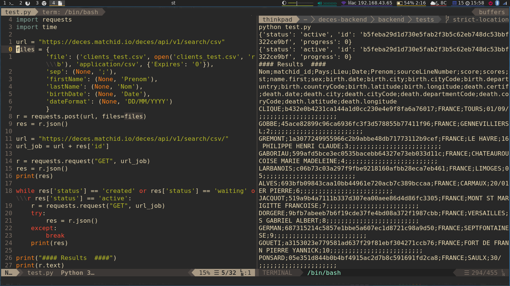

    

    

    Le Système d’Immatriculation des Véhicules (SIV) dispose des informations concernant les titulaires de certificat d'immatriculations. 

    

    Il est nécessaire d'enlever les personnes décédées pour améliorer la qualité des données et éviter des cas de fraude liées à l'immatriculation des véhicules. 
 
    

    [matchID] permet de radier les personnes décédées de forme mensuel au fichier d'immatriculation des véhicules.  

    
<strong> Agence Nationale des Titres Sécurisés </strong>

    

    <h3> Détection des personnes décédées en masse au sein d'une base de données </h3>
    
 

    

        Avez-vous une grande base de données d'identités et vous souhaitez enlever les personnes décédés ?
    

    

    Pour des traitement des données très volumineux vous pouvez installer le produit on-premise sur une infrastructure adapté pour faire le traitement à large échelle.
    Le traitement peut se paralléliser pour réduire notablement les temps de traitement. 
    

    

        Quatre étapes seront nécessaires:
    

    <h4> Étape 1. Base de données </h4>
    

        Vous pouvez vous lire directement à partir d'une base de données et préparer les requêtes à faire à l'API de traitement.
        Assurez vous d'avoir au minimum le nom, prénom et date de naissance pour faire le rapprochement. Pour garantir plus la fiabilité du rapprochement et éviter les homonymes parfaits (même date de naissance et même prénom), il est recommandé d'utiliser des données sur le lieu de naissance.
    

    

           
        
        

            Optimiser les paramètres de la requête. Concurrence des taches et taille du chunk à traiter.
        

    

