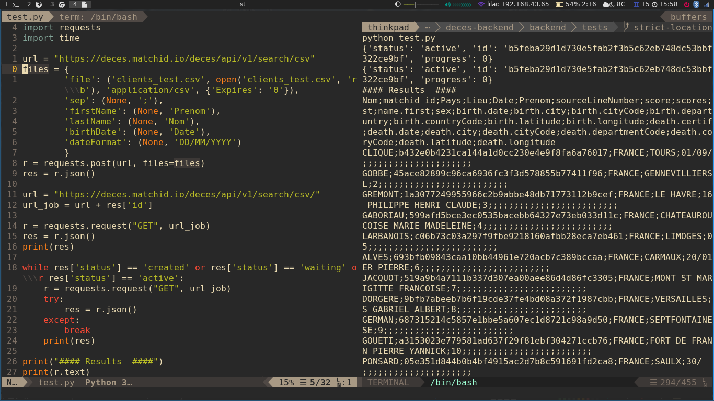

    

    

    Le Système d’Immatriculation des Véhicules (SIV) dispose des informations concernant les titulaires de certificat d'immatriculations. 

    

    Il est nécessaire d'enlever les personnes décédées pour éviter des cas de fraude liées à l'immatriculation des véhicules, et en particulier pour les infractions de la route. 

    

    [matchID] permet de radier les personnes décédées chaque mois au fichier d'immatriculation des véhicules.  

    
<strong> Agence Nationale des Titres Sécurisés </strong>

    

    <h3> Détection des personnes décédées en masse au sein d'une base de données </h3>
    
 

    

        Avez-vous une grande base de données d'identités et vous souhaitez y retirer les personnes décédés ?
    

    

    Pour des traitements de données très volumineux vous pouvez installer le produit on-premise sur une infrastructure adaptée pour porter le traitement à large échelle.
    Le traitement peut se paralléliser pour réduire notablement les temps de traitement.
    

    

        Quatre étapes seront nécessaires:
    

    <h4> Étape 1. Base de données </h4>
    

        Vous pouvez vous lire directement à partir d'une base de données et préparer les requêtes à faire à l'API de traitement.
        Assurez vous d'avoir au minimum le nom, prénom et date de naissance pour faire le rapprochement. Pour garantir plus la fiabilité du rapprochement et éviter les homonymes parfaits (même date de naissance et même prénom), il est recommandé d'utiliser des données sur le lieu de naissance.
    

    

           
        
    

    <h4> Étape 2. Déployer sur une architecture massive </h4>
    

      Pour accélérer le traitement, il est conseillé de déployer sur une architecture massive (>32vCPU, 128Go de RAM).
    

    

      Il est possible d'optimiser la mémoire pris par elasticsearch, il est recommandé de donner la moitie de la RAM du serveur. Sur le code du backend ça correspond à la variable `ES_MEM`
    

    

      L'API peut découper l'input en chunks et les traiter de façon concurrente. Sur le code du backend ça correspond au paramètre `BACKEND_CONCURRENCY_JOB` et `BACKEND_CONCURRENCY_CHUNKS`.
    

    

        
    

    <h4> Étape 3. Request the API </h4>
    

      Paralleliser les requêtes pour profiter au maximum des ressources de la machine.
      Nous proposons d'utiliser de librairies comme multiprocessing pour le traitement.
    

    

      Chaque thread va faire la requete et enregistrer le resultat dans une base de données.
    

    

        <iframe frameborder="0" width="100%" height="600px"
            scrolling="no" style="margin-top: 0px;"
            src="https://repl.it/@cristianpb/thread-bulk-decespy?lite=true"
        ></iframe>
    

