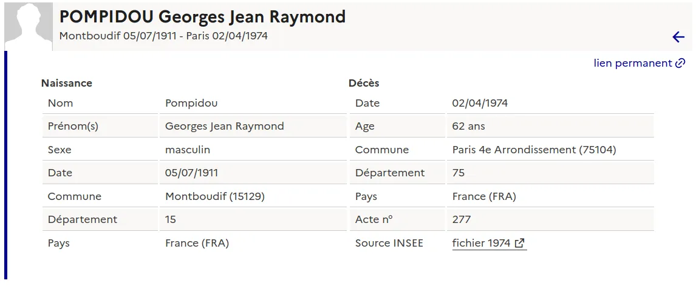
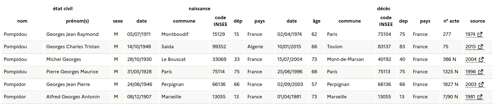
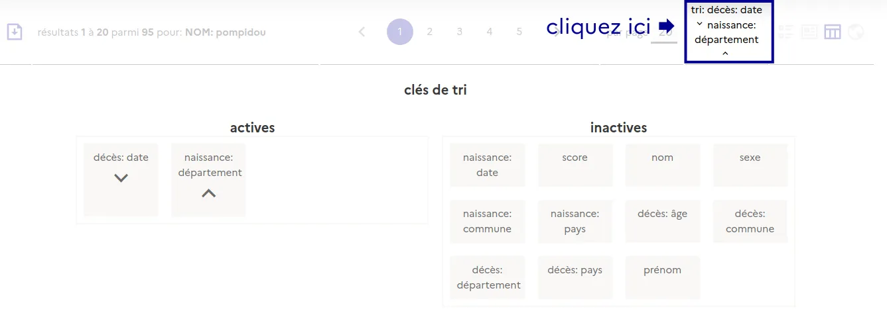
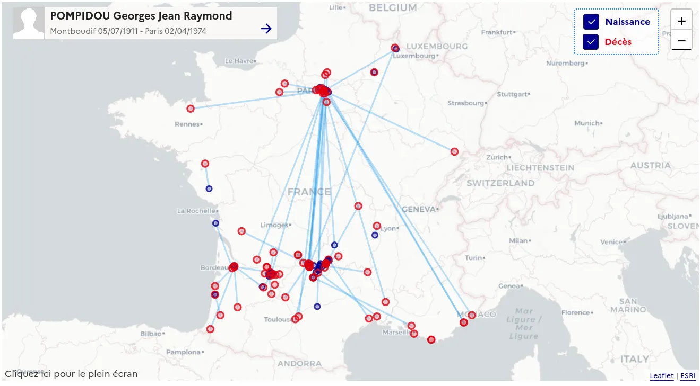
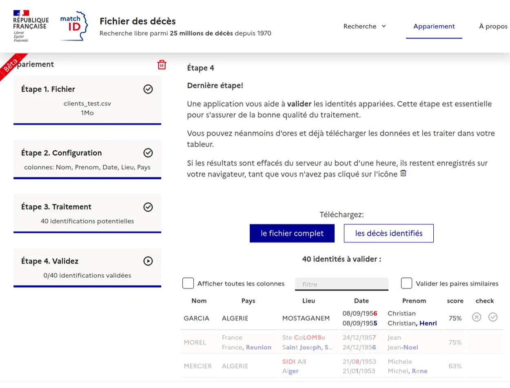

    <h3 class="fr-text--center"><a href="https://deces.matchid.io/search" title="moteur de recherche des décès">deces.matchid.io</a></h3>
    

    Le moteur de recherche matchID permet une recherche simple, rapide et intuitive des personnes dont le décès a été enregistré, depuis 1970, dans le <a href="https://www.data.gouv.fr/fr/datasets/fichier-des-personnes-decedees/" target="_blank">fichier de l'INSEE</a> soit plus de <strong>25 millions d'enregistrements</strong>.
    

    <h3 class="fr-text--center fr-hero">
    Visualisez les données selon vos préférences
    </h3>
    

    Plusieurs modes de visualisation sont disponibles, pour vous permettre le meilleur confort dans vos recherches:
    

  <h4>Fiches compactes</h4>
  

    <iframe frameborder="0" width="100%" height="520px"
        scrolling="no" style="margin-top: -200px;"
        src="https://deces.matchid.io/search?q=Pompidou%20Georges"
    >
    </iframe>
  

    <h4> Fiches étendues </h4>
    

        Elle vous permettent de prendre connaissance de toutes les informations disponibles
        dans la base INSEE.
    

     
    

    <h4> Tableur </h4>
    

    
    

    <h3 class="fr-text--center fr-hero">
        Recherche avancée
    </h3>

    <h4> Critères multiples </h4>
    

        Utilisez les critères avancés pour rechercher plus finement, par exemple par plage de date,
        par département, ville, ...
    

     
    
    <h4> Recherche floue ou stricte </h4>
    

        Activez ou désactivez la recherche floue en fonction de votre recherche. Par défaut la recherche
        floue est activée pour élargir et maximiser les chances de retrouver un décès, avec une tolérance
        aux erreurs de saisie. La désactivation permet
        au contraire de restreindre les possibles notamment lors de patronymes très communs.
    

    <h4> Triez </h4>
    

        Triez les résultats pour mieux retrouver les données lorsque vous ne disposez pas
        de données complètes.
    

       
    
    <h4> Téléchargez </h4>
    
Si l'ensemble des outils de visualisation ne sont pas suffisants, vous pouvez télécharger
    le résultat de la recherche (moins de 500.000 enregistrements) et l'exploiter sous votre tableur
    préféré
    

    

    <h4> Visualisation géographique </h4>
    

        Un outil de visualisation géographique est à votre disposition, pour vous permettre un mode de recherche alternative. Cette visualisation est idéal pour visualiser la provenance géographique d'un patronyme.
    

     
    

    <h4> Appariement en masse </h4>
    

        Vous disposez d'un tableur avec l'ensemble de vos fiches, et souhaitez les fiabilisez ? Utiliser notre outil d'appariement en masse
    

     
    

    <h3> Commencez vos recherches ! </h3>

    <a href="https://deces.matchid.io/search" class="fr-link fr-link--icon-right" target="_self" title="Recherche simple"> Recherche simple</a>

    <a href="https://deces.matchid.io/search?advanced=true" class="fr-link fr-link--icon-right" target="_self" title="Recherche avancée"> Recherche avancée</a>

    <a href="https://deces.matchid.io/link" class="fr-link fr-link--icon-right" target="_self" title="Appariement"> Appariement</a>

