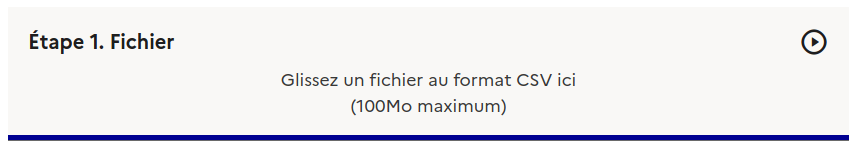
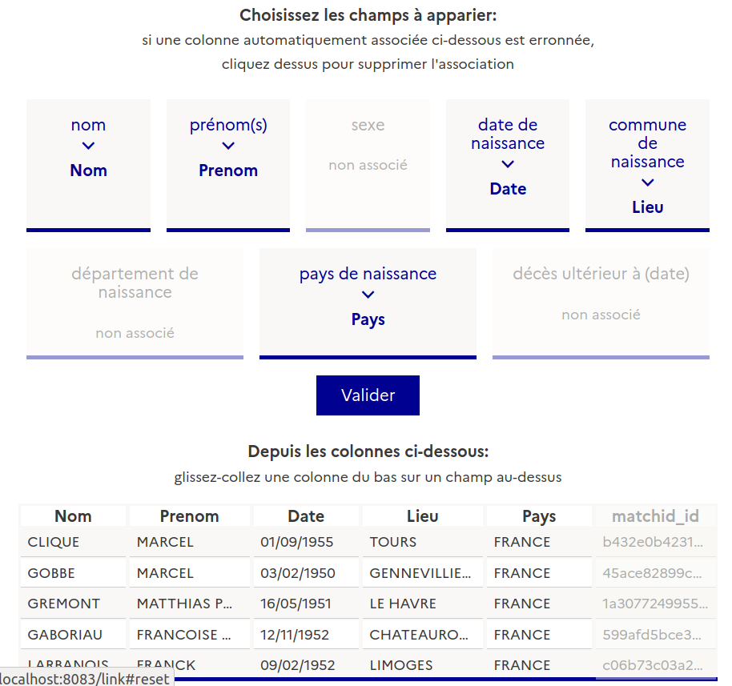
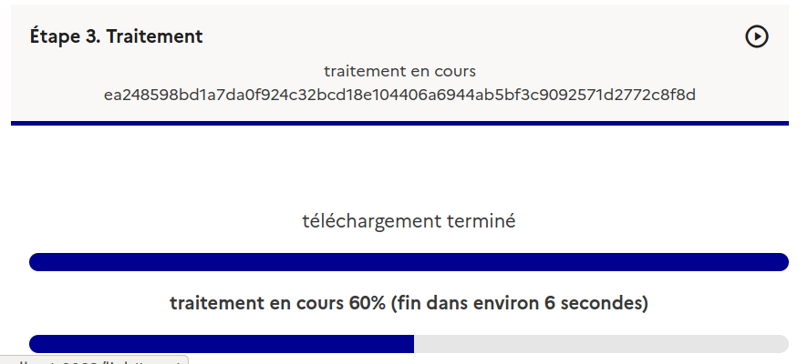
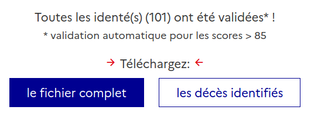

    

    J’ai deux études [autour de la maladie d'Alzheimer] qui utilisent des données de l’INSEE. [...] Il est actuellement très difficile pour les cliniciens actuellement de donner un pronostic aux patients et à leur famille, alors qu’ils sont en demande.  
    [matchID] <strong>me fait gagner un temps considérable</strong>. Pour le versant clinique je dois apparier plus de 100 000 dossiers, pour mes travaux, c’est 15 000 par étude. En fait sans votre outil, je ne récupèrerai juste pas les dates de décès. 
    
<strong> Mélanie L., CHU de Lille </strong>

    

    <h3> Détection des personnes décédées au sein d'un fichier </h3>
    
 

    

        Vous menez vous aussi une étude clinique et souhaitez fiabiliser votre fichier patient ?
    

    

    Avec la fonction d'appariement en masse de <a href="https://deces.matchid.io/link" target="_self" >matchID</a>, vous pouvez identifier les décès au sein de votre fichier en très peu de temps.
    

    

        Quatre étapes seront nécessaires:
    

    <h4> Étape 1. Fichier </h4>
    

        Votre fichier patient doit être au format CSV. Il est recommandé de disposer des 4 champs (nom, prénom, lieu et date de naissance) pour garantir que les identités sont fiables. Sans ces 4 champs, certaines identités sont ambigües, et il est délicat de garantir les identifications.
    

    

        Pour vous assurer le maximum de sécurité dans le traitement du fichier patient, votre fichier ne sera transmis qu'après la fin de la configuration. Le fichier transmis n'est pas conservé. Le résultat de l'appariement est conservé chiffré (AES256) et supprimé une heure après la fin de l'appariement, et seule la clé qui vous est transmise vous permet de le récupérer et de le déchiffrer.
    

    

        

            La première étape est donc de choisir votre fichier patient par glisser-coller sur
        

           
        
    

    <h4> Étape 2. Configurer le traitement </h4>
    

        Choisissez les champs à utiliser pour l'appariement. Il s'agit d'identifier les champs de votre fichier correspondant au nom, prénom, lieu et date de naissance. Le dernier champ est utilisable pour une date de dernière visite du patient (afin de ne chercher que dans les décès ultérieurs).
    

    

        Les champs appariées automatiquement sont présentées au-dessus, et un extrait de votre fichier figure au-dessous. En cas d'erreur dans la détection automatique, vous pouvez libérer le champ en cliquant sur la paire. Et glisser le champ correct depuis l'extrait présent au-dessous.
    

    

        Une fois la configuration terminée, vous pouvez soumettre le traitement en cliquant sur <strong>Valider</strong>. Vous pourrez tester plusieurs configurations, selon la qualité des champs de votre fichier, il peut
        y avoir plusieurs options en particulier sur le lieu.
    

    

        
    

    <h4> Étape 3. Traitement </h4>
    

        A l'étape 3, le fichier est téléchargé vers notre serveur, puis le traitement est lancé. Un temps estimatif
        vous est donné, basé sur l'avancement réel du traitement. Nous traitons entre 50 et 100 identités
        par seconde sur ce service gratuit. Vos données restent chiffrées côté serveur, avec une clé dont vous seul disposez (transmise au moment du traitement).
    

    

        Vous pouvez quitter l'onglet et revenir ultérieurement, la clé d'accès
        est stockée sur le navigateur. Attention néanmoins, le résultat est effacé au bout d'une heure. Sinon,
        laissez l'onglet ouvert le traitement sera récupéré et stocké dès fin de traitement et archivé sur votre
        navigateur, même ap suppression du fichier de notre serveur.
    

    

           
        
    

    <h4> Étape 4. Valider </h4>
    

        Le traitement fini, vous pouvez soit directement télécharger le fichier, soit le vérifier sur votre navigateur.Dans cette étape, le service est totalement déconnecté, les donnée sont stockées dans votre navigateur.
    

    

        Les identités des personnes détectées comme décédées sont à valider sont présentées en haut, et celles déjà validées en bas. Les appariement avec un score supérieur à 85% sont automatiquement validées.
    

    

        Pour un appariement donné, la donnée relative à votre fichier est située au dessus de la donnée de l'identité de décès, champ par champ. Lorsqu'il n'y a qu'une ligne, c'est que les données concordent. Les différences sont indiquées en couleur.
    

    

    

        Vous pouvez également afficher les autres colonnes de votre fichier d'origine, si cela vous est utile.
    

    

        
    

    

        Une fois les identités validées, ou à n'importe quel moment, vous pouvez télécharger les résultats en format CSV
    

    

        
    

    

        Vous pouvez alors utiliser le fichier apparié pour fiabiliser vos travaux. Si vous souhaitez
        industrialiser le traitement pour des travaux récurrents, vous pouvez également intégrer notre
        API dans votre système d'information.
    

    <h3 class="rf-text--center"> Commencez votre appariement </h3>

    <a href="https://deces.matchid.io/link" class="rf-link rf-link--icon-right" target="_self"> Appariement</a>

    <a href="/link-api" class="rf-link rf-link--icon-right" target="_self"> Utiliser l'API décès</a>

