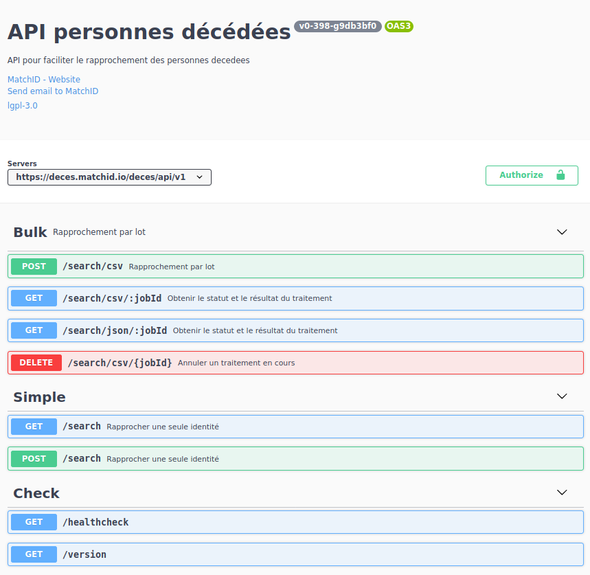
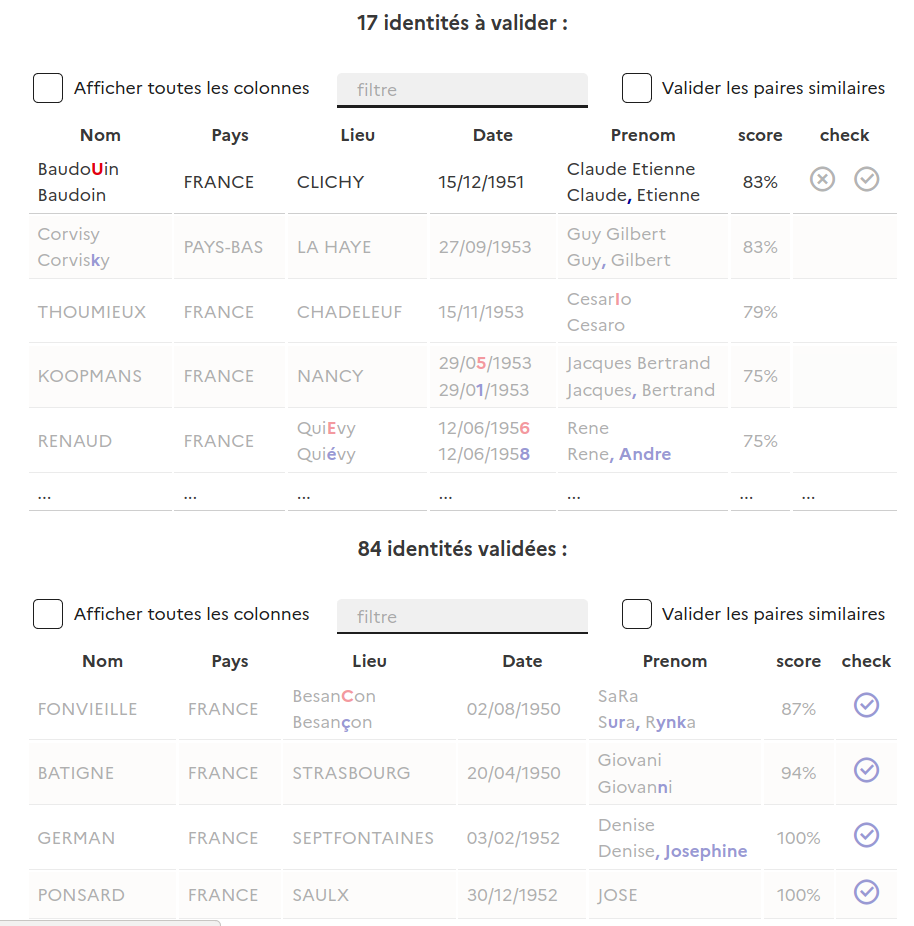

<!-- Prism.js pour le surlignage syntaxique -->
<link rel="stylesheet" href="https://cdn.jsdelivr.net/npm/prismjs/themes/prism.css">

    <h3>Quelle API pour quel usage</h3>
    

        L'API décès possède deux principales fonctions:
        <ul>
            <li>la recherche unitaire</li>
            <li>l'appariement (liste de personnes à rechercher)</li>
        </ul>
    

    

    La première sera utile dans un contexte utilisateur (un <strong>formulaire dte données
    de données d'État civil</strong>, où l'appel API servira à vérifier la vitalité d'une personne).
    

    

    La seconde est utile pour compléter le statut vital d'une <strong>base de donnée clients</strong> au sein d'un système d'information, de plusieurs milliers à environ un million de personnes
    

    

        La <a href="https://deces.matchid.io/deces/api/v1/docs" title="documentation OpenApi" target="_self">documentation de l'API</a> est réalisée au format OpenApi Specification (OAS3, Swagger).
    

    

        Elle décrit de façon détaillée les champs et leur format.
    

    

    <h3>Intégration d'un formulaire</h3>
    

        Le cas d'usage basique est l'utilisation, de la recherche simple (<code>q=Pompidou...</code>)
        depuis la valeur d'un formulaire (<code>input</code>).
    

    
    

        Le code suivantci-contre est l'implémentation de cas en <strong>Svelte.js</strong>. Cliquez sur "output" pour voir le résultat, ou rendez-vous sur ce <a href="https://svelte.dev/repl/442012e7de2d4a4080b1e2c0da359cfe?version=3.31.0" target="_blank" title="REPL">REPL</a>.
    

    

        L'exemple utilise l'API search en mode <code>GET</code>, documentée <a href="https://deces.matchid.io/deces/api/v1/docs/#/Simple/Search" title="API search (GET)" target="_blank">ici</a>.
        Sa transposition en <code>POST</code> est simple et préférable pour la robustesse d'un code de production.
    

    

        <iframe frameborder="0" width="100%" height="600px"
            scrolling="no" style="margin-top: -116px;"
            src="https://svelte.dev/repl/442012e7de2d4a4080b1e2c0da359cfe?version=3.31.0"
        ></iframe>
    

    <h3>Intégration de l'API d'appariement à un backend</h3>
    

        L'API unitaire est limité à une requête par seconde. Pour les appariement en masse,
        une API <code>search/csv</code> permette le traitement de <strong>50 à 100 requêtes par seconde</strong>.
    

    

        Cette API de soumettre un CSV contenant jusqu'à <strong>1 millions d'identité</strong> (100Mo), qui sera complété d'éventuelles détections des données de décès en cas de correspondance celle-ci étant qualifiée par un score de confiance.
    

    
    

        Ces données peuvent être retraitées à l'issue pour être injectées dans votre base de donnée.
    

    

        Voici un exemple minimaliste en Python pour utiliser l'API d'appariement:
    

    

      

        

          1 2 3 4 5 6 7 8 9 10 11 12 13 14 15 16 17 18 19 20 21 22 23 24 25 26 27 28 29 30
        

      

      

        <pre style="margin: 0; padding: 8px; font-size: 0.9em;"><code class="language-python">import requests
import time
url = "https://deces.matchid.io/deces/api/v1/search/csv"

# Formulaire multipart avec mapping des colonnes et paramètres CSV
files = {
    'file': ('misc_sources_test.csv',
            open('misc_sources_test.csv', 'rb'),
            'application/csv', {'Expires': '0'}),
    'sep': (None, ','),             # séparateur csv
    'firstName': (None, 'PRENOM'),  # mapping des champs
    'lastName': (None, 'NOM'),
    'birthDate': (None, 'DATE_NAISSANCE'),
    'birthCity': (None, 'COMMUNE_NAISSANCE'),
    'birthDepartment': (None, 'DEP_NAISSANCE'),
    'birthCountry': (None, 'PAYS_NAISSANCE'),
    'sex': (None, 'GENRE'),
    'candidateNumber': (None, '5'),
    'pruneScore': (None, '0.3'),
    'dateFormat': (None, 'DD/MM/YYYY') # format de date
}
r = requests.post(url, files=files)
print(r.text)
res = r.json()
# Récupération de l'ID pour suivre l'avancement du traitement
print(res['id'])

url = "https://deces.matchid.io/deces/api/v1/search/csv/"
url_job = url + res['id']
print("url: ", url_job)

r = requests.request("GET", url_job)
print(r.text)
res = r.json()
print(res)

while res['status'] == 'created' or res['status'] == 'waiting' or res['status'] == 'active':
    r = requests.request("GET", url_job)
    try:
        # Vérification de l'état du traitement via JSON
        res = r.json()
    except:
        # Job terminé si réponse non-JSON
        break
    time.sleep(2)
    print(res)

# CSV source complété des données de décès
print(r.text.replace(";","\t"))
        </code></pre>
      

    



    <h3> Intégration d'une UI de validation </h3>
    

        Nous vous recommandons dans un premier temps de passer par <a href="https://deces.matchid.io/link" title="appariement sur deces.matchid.io" target="_self">le service en ligne</a> pour tester la validité du fichier et du choix des colonnes à apparier avant d'attaquer le code d'appariement. Vous pourrez, en particulier, vérifier avec l'aide de l'UI de validation.
    

    

        Dans le cas d'un service métier intégré dans un système d'information, pour des appariement réguliers, nous recommandons d'intégrer une UI de validation telle que celle proposée.En effet, l'UI proposée permet de <strong>diviser en moyenne par 10 le temps de validation d'une paire d'identité</strong> par rapport à un affichage en colonnes classiques sous un tableur.
    

    

        Pour traiter un fichie de 100000 lignes, si 10% de personnes sont décédées, environ 9000 seront avec de très bon scores (peu utiles à valider à la main, sauf cas métier nécessitant une assurance complète), et 1000 seront à regarder plus précisément. Ces 1000 cas peuvent prendre moins de 30 minutes avec une UI adaptée, contre une demie jourée sur un tableur.
    

    

        A ce stade, nous n'avons pas mis à disposition de composant réutilisable pour cette fonction.
        Néanmoins <strong>nos deux implémentations d'interface de validation peuvent vous inspirer</strong>: en <a href="https://github.com/matchID-project/deces-ui/blob/dev/src/components/views/LinkCheckTable.svelte" target="_blank" title="composant de validation en Svelte.js">Svelte.js</a> ou en <a href="https://github.com/matchID-project/frontend/blob/dev/src/components/Validation/DataTable.vue" target="_blank" title="composant de validation en Vue.js">Vue.js</a>.
    

    

    
    

       Les composants développés implémentent une <strong>mise en exergue des différences champs par champ</strong> (nom, prénom, ...) entre la donnée cherchée et la donnée de référence INSEE. Cette facilitation visuelle est la
       source d'accélération de la validation. Nos implémentations reposent sur la <a href="https://www.npmjs.com/package/diff.js" title="librairie diff.js" target="_blank">librairie diff.js</a>.
    

    

    <h3> Authentification </h3>
    

        L'API est utilisable sans authentification pour un nombre limité d'appels sur l'API de recherche. Pour utiliser l'API au-dela d'une centaine d'appels, ou pour utiliser l'API d'appariement, l'utilisation d'un jeton est nécessaire, tout en restant gratuite.
    

    

        Voici les étapes si vous voulez automatiser l'obtention de la clé d'API pour un an:
    

    <h4> Étape 1 - Creation manuelle du jeton </h4>
    

        <ul>
            <li>S'enregistrer et confirmer son identité manuellement sur deces.matchid.io</li>
            <li>Récupérer le jeton dans le menu d'utilisateur (en haut à droite) > API Key. La clé devrait commencer par
                <code>eyJhbGc*</code>
            </li>
        </ul>
        Ce jeton est valable 30 jours sans changement et permet de dériver de nouveaux jetons jusqu'à 12 mois.
        L'obtention d'un nouveau jeton (avec confirmation de mail) reste obligatoire tous les 12 mois.
    

    <h4> Étape 2 - Automatisation pour un an </h4>
    

        Vous pouvez rafraîchir votre jeton initial sans limite de la façon suivante:
        <ul>
            <li>
                Pour tout appel à l'API: il suffit d'ajouter le Header: <code>Authorization: "Bearer <i>accessToken</i>"</code>, en remplaçant <code><i>accessToken</i></code> par votre jeton. Des limitations demeurent sur la fréquence d'appel (1/s pour la recherche) mais le nombre d'appels devient illimité.
            </li>
            <li>
                Pour rafraîchir le jeton : avec ce même Header faire un GET sur <code>https://deces.matchid.io/deces/api/v1/auth?refresh=true</code> - ne nouveau jeton récupéré permettra de réitérer les opérations jusqu'à 12 mois.
            </li>
        </ul>
    

    

        Vous pouvez faire une demande de rafraîchissement tous les jours par exemple, il n'y a pas de limite (il est inutile d'en faire une demande a chaque appel, mais ce peut être à chaque session si vous faites des appels consécutifs de 5 minutes ou même moins).
    

    <h4> Exemple de code Python pour le renouvellement automatique </h4>
    

        Voici un exemple de code Python qui permet de gérer automatiquement le renouvellement du token :
    

    

      

        

          1 2 3 4 5 6 7 8 9 10 11 12 13 14 15 16 17 18 19 20 21 22 23 24 25 26 27 28 29 30
        

      

      

        <pre style="margin: 0; padding: 8px; font-size: 0.9em;"><code class="language-python">import requests
import json
from datetime import datetime, timedelta

class TokenManager:
    def __init__(self, initial_token):
        self.token = initial_token
        self.last_refresh = datetime.now()
        self.refresh_interval = timedelta(days=1)  # Rafraîchir tous les jours
        
    def get_token(self):
        # Vérifier si le token doit être rafraîchi
        if datetime.now() - self.last_refresh > self.refresh_interval:
            self.refresh_token()
        return self.token
    
    def refresh_token(self):
        headers = {
            "Authorization": f"Bearer {self.token}"
        }
        response = requests.get(
            "https://deces.matchid.io/deces/api/v1/auth",
            params={"refresh": "true"},
            headers=headers
        )
        
        if response.status_code == 200:
            data = response.json()
            self.token = data["access_token"]
            self.last_refresh = datetime.now()
            print(f"Token rafraîchi avec succès. Nouvelle date d'expiration: {data['expiration_date']}")
        else:
            print(f"Erreur lors du rafraîchissement du token: {response.text}")

# Exemple d'utilisation
if __name__ == "__main__":
    # Token initial obtenu manuellement
    initial_token = "eyJhbGc..."  # Votre token initial
    
    # Créer une instance du gestionnaire de token
    token_manager = TokenManager(initial_token)
    
    # Exemple d'utilisation dans une requête API
    def faire_requete_api():
        headers = {
            "Authorization": f"Bearer {token_manager.get_token()}"
        }
        response = requests.get(
            "https://deces.matchid.io/deces/api/v1/search",
            params={"q": "Georges Pompidou"},
            headers=headers
        )
        return response.json()
    
    # La requête utilisera automatiquement un token valide
    resultat = faire_requete_api()
    print(json.dumps(resultat, indent=2))
        </code></pre>
      

    

    

        Ce code implémente une classe <code>TokenManager</code> qui :
        <ul>
            <li>Gère automatiquement le rafraîchissement du token tous les jours</li>
            <li>Vérifie si le token doit être rafraîchi avant chaque utilisation</li>
            <li>Utilise le header d'autorisation approprié pour les requêtes API</li>
        </ul>
    

    <h3> Pour continuer </h3>

    <a href="https://deces.matchid.io/link" class="fr-link fr-link--icon-right" target="_self"> Appariement en ligne</a>

    <a href="/algorithms" class="fr-link fr-link--icon-right" target="_self"> Algorithmes</a>

