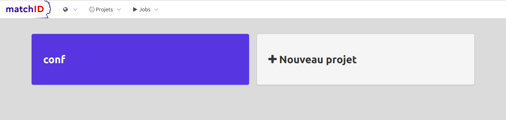

# **Quick tutorial** : finding common identities between two big datasets (easy case)

This first tutorial deals with a easy use case of matching identities of two datasets. 
An [advanced tutorial](/advanced_tutorial) is available for dealing with a more complexe case (over 1 million records), 
needing more accurate matching and using *maching learning*.

## **Cooking recipes with matchID** 

### Global method used for matching
This is our first use case : we have to remove dead people, as registered in dataset `deaths`, from a client file `clients`.
We'll follow four steps for use case 1.

- [Step 1: index deaths dataset](#step-1-index-deaths-dataset)
- [Step 2: match clients againts deaths](#step-2-match-clients)

### the philosophy of iterative cooking

So, the final goal is the match but we have first to deal with the way, which mainly is data preparation. So we'll learn here how to cook your data with recipes.

We propose a 4 or 5-step iteration method :

1. upload raw data and configuration files
2. edit yaml configuration files
3. test recipes
4. run recipes
5. (upload & apply recipe on the fly, if the goal is to develop a search api)

Iterating through these steps will allow you to create recipes and datasets for two purposes:

- prepare your datasets (upload, map names/dates/locations)
- search matches and score them 

Three further steps will enable machine learning capabilities in the [advanced tutorial](/advanced_tutorial) :

- validate the matches (through the [matchID-validation]() UI, see below)
- train machine learning models (using yaml edition and recipe testing again)
- apply for rescoring (idem)
- presenting an API for searching and rescoring new clients

The advanced use case relies on more than 50 treatments or steps. To be able to use it, you'll have to adapt it to your own use case.
But first, we'll deal with a simple use case

## start your matchID server

We suppose your matchID server is already started, as explained in [starting matchID](/starting).

Now, you can go to your `matchID` server : 

- [http://localhost/matchID/](http://localhost/matchID/)



## first project, first dataset, first recipe

### project

We'll first have to create a project. This will basically be a folder, containing datasets and recipes (data transformation). 
Here we'll simply name it `deaths`.


Which leads to:


*Note :
- The segmentation of the projects are very easy to do server-side, as it only contains two sub-folders, datasets and recipes. We didn't implement methods for splitting or reorganising project at this step of the development, as the ratio of benefit/cost of folder management is very low.
- There is no project versioning : you have to do your own versioning - at this step we do it by gitting them server side, so be careful in any change you make - git may be supported in a theorical future*.

### dataset

Click again on `import dataset` and just drag-n-drop (thx to [Dropzone](http://www.dropzonejs.com/)) the [`death_test.csv`](https://github.com/matchID-project/examples/raw/master/data/deaths_test.csv) downloaded from the [examples matchID repo](https://github.com/matchID-project/examples).


Now you have your first dataset:


Please care about the screen composition :
	- on the left pane: yaml coding part (thx to [codemirror](https://codemirror.net/)) with the dataset declaration.
	- on the right pane: the dataset view, as declared in the yaml on the left.
  
About the data: it is a clean synthetic data of French civil statuses. This file is a simple csv with no formatting or encoding problem. In the [advanced tutorial](/advanced_tutorial) you'll learn to deal with fixed with formats and encoding problems.

### first recipe

Create a new recipe :


A default recipe is created with no valid dataset, just replace it with the uploaded dataset, `deaths_test_csv` - as this can be done now, we already figure out we have a `deaths` dataset we'll configure after finishing the recipe.

```
recipes:
  dataprep_deaths_test:
    input: deaths_test_csv    # <==== necessary to change to continue
                              # there are advanced usage of dataset, such as filtered dataset, cf advanced docs
    output: deaths            # to be configured after the recipe
    steps:                    # this is the beginning of the recipe
      - eval:
          - matchid_id: sha1(row)  # just change the default 'new_col' to matchid_id which will be used further
```
Save it (`Save` button or `Ctrl+S`), it should display the first imported dataset, but with an additionnal column, `new_col` which is basically a hash of the row:


So now you have an interactive way to deal with your data. 
Every new step of the recipe will add a new transformation on your data. 
You can have the exhaustive list of [recipes here](recipes.md), and see advanced recipes in [advanced tutorial](/advanced_tutorial).

## **Step 1** - index deaths dataset

### configure the output dataset on elasticsearch

We have to create the `deaths` dataset as formerly pointed as the output dataset of the recipe. 
Just create it from the menu and paste this content :

```
datasets:
  deaths:
    connector: elasticsearch # this is the predeclared connector to the dockerized elasticsearch
    table: deaths            # name of the index
```
And don't forget to save it (`Save` button or `Ctrl+S`).
Note that you can configure many options for an elasticsearch dataset, still illustrated in the [advanced tutorial](/advanced_tutorial).

### run the recipe !
So once everything is configured, you can go to the recipe `dataprep_death_test` and run it with the green button : 


This run is needed to index the deaths with elasticearch, which will enable a match of up to 98% (recall) in real usecases.

You can follow the job either directly in the bottom in the "Real logs":


This should take about 45 seconds on your laptop to index the 71k rows. 

The job log last line should summarize the time and bugs for the recipe :
```
 2018-04-02 21:17:39.715749 - 0:00:42.308387 - end : run - Recipe dataprep_deaths_test successfully fininshed with no error, 71404 lines processed, 71404 lines written
```

## **Step 2** - match clients against deaths

### upload dataset
You should be able to follow the former steps on the new file, `clients`.

Then import the dataset [`clients_test.csv`](https://github.com/matchID-project/examples/raw/master/data/clients_test.csv).


This data is quite easy and doesn't need dataprep for quick-n-dirty results.

### matching !
Here comes the first important part : the fuzzy match with elasticsearch. 
We choose here to use elasticsearch as is it quite versatile (can perform ngram, phonetic and string-distance tolerant) for fuzzy matching.
 
So, now you have to match every client against the already-indexed-in-step-1 deaths. 

First create a recipe named `clients_deaths_matching_test`:
```
recipes:
  clients_deaths_matching_test:
    input: clients_csv_test
    output: clients_x_deaths
    steps:
      - join: 
          type: elasticsearch
          dataset: deaths
          query:
            size: 1
            query:
              bool:
                must:
                  - match:
                      DCD_NOM: Nom
                  - match:
                      DCD_DATE_NAISSANCE: Date
```

So you'll see this first matching results:


Some observations :
- only clients with a death match appear : you have to add an option `keep_unmatched: true` to add in `join` to make clients with no match appear
- matching is quite quite unefficient for many reasons: 
  - date is tokenized as the caracter '/' is used, so partial matching with dates are ok. We could have prepared dates for less tolerance
  - only the first name is used

Here is a more complete search :
```
recipes:
  clients_deaths_matching_test:
    test_chunk_size: 30
    input: clients_csv_test
    output: clients_x_deaths
    steps:
      - join: 
          type: elasticsearch
          dataset: deaths
          keep_unmatched: True                      # keeps rows with no match
          query:
            size: 1
            query:
              bool:
                must:
                  - match:
                      DCD_NOM: 
                        query: Nom
                        fuzziness: auto             # tolerate fuzzy (up to 2 errors in name)      
                  - match:
                      DCD_DATE_NAISSANCE: Date
                  - match:
                      DCD_PRENOMS:                  # one token at least should match, with up to 2 errors 
                        query: Prenom
                        fuzziness: auto 
                should:
                  - match:                          # if place of birth match it is better but not mandatory
                      DCD_COMMUNE_NAISSANCE: Lieu
```


Now we see there is some noise we should be able to filter easily

### scoring

As we are in a recipe, we can add additionnal steps, we'll use to score distance of names, place and dates of birth. 
Just add theses lines to the current recipe, which will remove wrong matches

```
      - eval:
      	# scores
          - score_date: levenshtein_norm(hit_DCD_DATE_NAISSANCE, Date)
          - score_nom: levenshtein_norm(hit_DCD_NOM, Nom)
          - score_prenom: jw(hit_DCD_PRENOMS, Prenom)
          - score_lieu: jw(hit_DCD_COMMUNE_NAISSANCE, Lieu)
          - confiance: round(100 * score_lieu * score_nom * score_prenom * score_date)
```

This will add a `confiance` column you'll be able to filter.

Depending on whether you want to have a new clients file with deaths match or a new clients_x_deaths only with the intersection, you should configure your recipe to blank the lines or to remove bad matches :

To blank bad matches :
```
      - eval:
	# blank low score lines
          - hit_DCD_COMMUNE_NAISSANCE: hit_DCD_COMMUNE_NAISSANCE if (confiance > 30) else ""
          - hit_DCD_DATE_NAISSANCE: hit_DCD_DATE_NAISSANCE if (confiance > 30) else ""
          - hit_DCD_NOM: hit_DCD_NOM if (confiance > 30) else ""
          - hit_DCD_PRENOMS: hit_DCD_PRENOMS if (confiance > 30) else ""
          - hit_matchid_id: hit_matchid_id if (confiance > 30) else ""
```

Or to filter bad matches :
```
      - keep:
          where: confiance > 20
```

Don't forget to declare `clients_x_deaths` (in csv or elasticsearch depending where you want to have your results), then run the recipe.

It should take about 3 minutes on a laptop to proceed the 16k rows.

### View results in the validation app

To display the results in the validation app you have to declare the dataset in a special way to format the display :

```
datasets:
  clients_x_deaths:
    connector: elasticsearch
    table: clients_x_deaths
    validation: 
      columns:
        - field: matchid_id
          label: Id
          display: false
          searchable: true
        - field:
            - Nom
            - hit_DCD_NOM
          label: nom
          display: true
          searchable: true
          callBack: formatDiff
        - field:
            - Prenom
            - hit_DCD_PRENOMS
          label: prenom
          display: true
          searchable: true
          callBack: formatDiff
        - field:
            - Date
            - hit_DCD_DATE_NAISSANCE
          label: date
          display: true
          searchable: true
          callBack: formatDate
          appliedClass:
            head: head-centered
            body: has-text-centered
        - field:
            - Lieu
            - hit_DCD_COMMUNE_NAISSANCE
          label: Lieu
          display: true
          searchable: true
          callBack: coloredDiff
        - field: confiance
          label: Score
          display: true
          searchable: false
          type: score
          callBack: formatNumber
          appliedClass:
            head: head-centered
            body: has-text-centered min-column-width-100
      view:
        display: true
        column_name: view
        fields:
          operation: excluded
          names:
            - none
      scores:
        column: confiance
        range:
          - 0
          - 100
        colors:
          success: 80
          info: 60
          warning: 30
          danger: 0
        statisticsInterval: 5
        preComputed:
          decision: 55
          indecision:
            - 40
            - 65
```

This configuration can be avoided if you had previously mapped your column names as in the [advanced tutorial](/advanced_tutorial)
Just save the configuration then you should have a blue `Validation` button you can click to have this final display:


This first quick-n-dirty try gives quite good results withs scores above 40 :

.

For advanced results, you should get a strong environnement (8vCPU at least, we recommend 16vCPU and the higher the better), and go to the [advanced tutorial](/advanced_tutorial) with more than 1M datasets.


