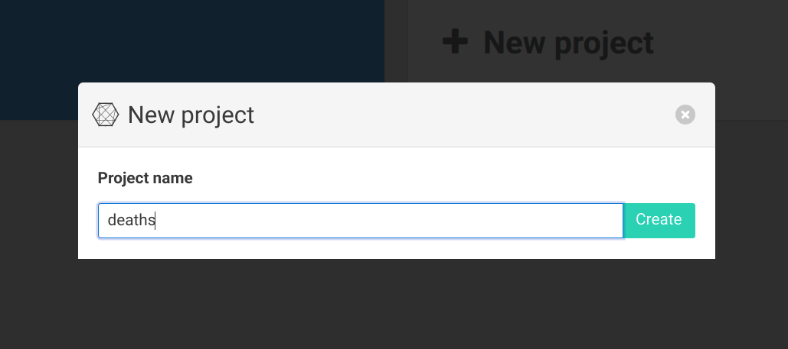

<div class="rf-col-lg-6 rf-col-md-12">
  <h3>Introduction</h3>
  <p>
  Ce tutoriel traite un cas simple d'apariement de deux jeux de données d'identité, l'un appelé <strong>deaths</strong> et l'autre <strong>clients</strong>. Le type de cas d'usage traité est la suppression des décès d'un fichier client, pour de la mise en qualité. Des cas similaires peuvent être envisager avec un SIRH et un annuaire, par exemple.
  </p>
  <p>
  Il s'adresse à des <strong>développeurs ou datascientists</strong> souhaitant s'initier à l'appariement d'identité, à un premier niveau de développement. Pour tout cas d'appariement, nous recommandons de passer par un premier appariement "simple" pour bien évaluer la problématique, et d'itérer en fonction du cas d'usage précis (nombre à apparier, qualité des données, enjeux métiers en précision et rappel, ...).
  </p>
  <p class="rf-highlight">
  <i>
   Premature optimization is the root of all evil (or at least most of it) in programming.
  </i>
  <br>
  <span class="rf-text--xs">Donald Knuth, 1974</span>
  </p>
</div>
<div class="rf-col-lg-6 rf-col-md-12" style="position:relative">
  <div class="rf-callout rf-fi-information-line rf-vcenter">
    <h4 class="rf-callout__title">Détecter les décès dans un fichier</h4>
    <p class="rf-callout__text">
        Si vous n'êtes pas datascientist ou développeur, mais souhaitez détecter les décès au sein de votre fichier client, c'est possible sans coder, ici :
    </p>
    <p>
      <a class="rf-link rf-link--icon-right" href="https://deces.matchid.io/link" title="appariement sur deces.matchid.io" target="_self">
        Accéder à deces.matchid.io
      </a>
    </p>
  </div>
</div>
<div class="rf-col-lg-1 rf-col-md-12"></div>
<div class="rf-col-lg-10 rf-col-md-12">
  <h3>Algorithme de <i> Data matching </i></h3>
  <p>
    Sauf méthode d'appariement en <code> n x n </code>, qui atteignent leur limites dès quelques centaines de milliers d'identité dans l'une des bases, la meilleure option reste l'usage d'une base de donnée. La base la plus compatible avec la plupart des cas d'usages reste Elasticsearch. PostGres pouvant être bien meilleure pour certains cas particuliers, consultez la <a href="/algorithms" title="algorithmes de matching">section algorithmes</a> après ce premier tutoriel. L'ouvrage <i>Data matching</i> de Peter Christen reste également un ouvrage de référence pour les curieux.
  </p>
  <p>Les étapes à observer systématiquement sont :</p>
  <p class="rf-highlight">
    <strong>1.</strong> Préparer et indexer la donnée de référence (deaths) <br>
    <strong>2.</strong> Préparer et matcher le fichier à apparier (clients) <br>
    <strong>3.</strong> Scorer la pertinence de chaque appariement et évaluer (clients x deaths) <br>
  </p>
  <p>
  La préparation de données est essentielle. L'observation fine des données d'identités est impérative.
  Dans cette phase initiale, il convient d'envisager au maximum l'enrichissement des données, et si possible de
  réconcilier les personnes par un identifiant technique (de type NIR, ...), parfois il arrive qu'on oublie cette base... Vous pourrez consulter la <a href="/numid" title="identité numérique">section des données d'identités</a> après ce premier exercice.
  </p>
  <p>
  Dans le <a href="/advanced_tutorial" title="tutoriel avancé">tutoriel avancé</a> nous implémenterons des techniques plus avancées pour la qualité des données, et évaluerons la qualité des appariement avec une interface d'annotation.
  Cette dernière étape est impérative dans un contexte de gros volumes, où chaque appariement ne pourra pas être confirmé manuellement. Cerise sur le gâteau, nous utiliserons un peu de <i>machine learning</i> même si l'utilité n'est avérée que dans les cas de très gros volume (la quantité d'annotation nécessaire étant importante).
  </p>
  <div class="rf-callout rf-fi-information-line">
    <h4 class="rf-callout__title">Préparer des recettes itérativement</h4>
    <p class="rf-callout__text">
        matchID est conçu autour d'une philosophie de recettes à préparer par petite itération. Pour la suite,
        nous utiliserons une méthode systématique :
    </p>
    <p class="rf-callout__text rf-p-2w">
          - définir des jeux de donnée d'entrée et cible<br>
          - faire une recette minimale<br>
          - tester en direct sur échantillon<br>
          - lancer la recette sur l'ensemble des données<br>
    </p>
    <p class="rf-callout__text">
        De jeu de donnée à jeu de donnée, en passant par des recettes,
        nous implémenterons l'algorithme de <i>data matching</i>.
    </p>
  </div>

</div>
<div class="rf-col-lg-1 rf-col-md-12"></div>

<div class="rf-col-lg-12 rf-col-md-12 rf-background--bs rf-hero">
  <h2 class="rf-color--white rf-ml-2w">
    Étape 1: préparer et indexer le fichier de référence (deaths)
  </h2>
</div>
<div class="rf-col-lg-6 rf-col-md-12">
  <h3><a href="http://localhost:8081" target="_blank" title="site local matchID">Lancez matchID</a></h3>
  Après avoir suivi l'<a href="/starting" title="installer matchID">installation de matchID</a>, vous devriez
  avoir cet écran:
</div>
<div class="rf-col-lg-6 rf-col-md-12 rf-mt-3w" style="position:relative">
  
</div>


<div class="rf-col-lg-12 rf-col-md-12">
<div class="rf-container--fluid">
<div class="rf-grid-row rf-grid-row--gutters-h" style="flex-direction: row-reverse;">

<div class="rf-col-lg-6 rf-col-md-12">
  <h3><a href="http://localhost:8081/" target="_blank" title="site local matchID">Créez votre premier projet</a></h3>
  <p>
  matchID rassemble ses recettes et déclaration de recettes au sein de projets, ou dossier. Créons un premier projet que nous appelèleron <code>death</code>. Vous devriez obtenir la vue ci-contre.
  </p>
  <p class="rf-text--xs">
  Note: matchID n'assure pas de gestion de version. A ce stade, le mieux est de référencer chaque projet
  comme repository <code>git</code> et de commiter après validation de chaque traitement.
  </p>
</div>

<div class="rf-col-lg-6 rf-col-md-12 rf-mt-3w" style="position:relative">
  
</div>

</div>
</div>
</div>

<div class="rf-col-lg-6 rf-col-md-12">
  <h3><a href="http://localhost:8081/matchID/projects/deaths" target="_blank" title="site local matchID">Importer le premier jeu de données</a></h3>
  <p>
  Cliquez sur <code>import dataset</code> et glissez-collez le fichier <code>deaths</code> que vous aurez téléchargé sur <a href="https://github.com/matchID-project/examples/raw/master/data/deaths_test.csv" title="fichie de décès anonymisé (test)" target="_blank">Github</a>.
  </p>
  <p class="rf-text--xs">
  Note: matchID n'assure pas de gestion de version. A ce stade, le mieux est de référencer chaque projet
  comme repository <code>git</code> et de commiter après validation de chaque traitement.
  </p>
</div>
<div class="rf-col-lg-6 rf-col-md-12 rf-mt-3w" style="position:relative">
  
</div>


<div class="rf-col-lg-12 rf-col-md-12">
<div class="rf-container--fluid">
<div class="rf-grid-row rf-grid-row--gutters-h" style="flex-direction: row-reverse;">

<div class="rf-col-lg-6 rf-col-md-12">
  <h3><a href="http://localhost:8081/matchID/projects/deaths/datasets/deaths_test_csv" target="_blank" title="données de décès">Visualisez les données</a></h3>
  <p>
  Vous pouvez alors voir le jeu de données apparaître sur l'interface, comme ci-contre.
  </p>
  <p>
  Observez la décomposition de l'écran: à droite pour la donnée, à gauche pour les recettes. Ces dernières peuvent être étendues en 2/3 d'écran ou plein écran en fonction des recettes à coder. Le sonnées quant à elles sont filtrables par contenu, et par nom de colonnes (avec des regexp).
  </p>
  <p class="rf-text--xs">
  Note: les données sont des données anonymisées et représentatives statistiquement de données réelles
  </p>
</div>

<div class="rf-col-lg-6 rf-col-md-12 rf-mt-3w" style="position:relative">
  
</div>

</div>
</div>
</div>

<div class="rf-col-lg-6 rf-col-md-12">
  <h3><a href="http://localhost:8081/matchID/projects/deaths/datasets/deaths_test_csv" target="_blank" title="données de décès">Première recette</a></h3>
  <p>
  À partir du menu <strong>Recettes</strong> choisissez <strong>Nouvelle recette</strong>.
  </p>
  <p>
  vous pouvez alors créer un nouveau traitement. Dans ce cas, les données sont de qualité, nous
  ne faisons qu'ajouter un identifiant. Il faut en revanche déclarer la source de données pour
  pouvoir voir le traitement. Vous pouvez copier la recette ci-dessous :
  </p>
</div>
<div class="rf-col-lg-6 rf-col-md-12 rf-mt-3w" style="position:relative">
  
</div>

<div class="rf-col-lg-12 rf-col-md-12">
  <br>
  <div class="rf-highlight" markdown="1">
  ```
    recipes:
      dataprep_deaths_test:
        input: deaths_test_csv
        output: deaths
                  # le dataset devra être
                  # déclaré après la recette
        steps:    # début des étapes de la recette
          - eval: # recette d'évaluation python
            - matchid_id: sha1(row)
                  # on crée la colonne matchid_id
                  # avec le hash de a ligne
  ```
  </div>
  <div markdown="1">
  La recette peut être sauvée (menu `Sauver` ou `Ctrl+S`), ce qui devrait rendre le résultat suivant:
  

  Vous pouvez trouver la liste exhaustive des [recettes ici](recipes), et des recettes en contexte dans le [tutoriel avancé](advanced_tutorial).
  </div>
</div>
<div class="rf-col-lg-12 rf-col-md-12">
  <h3><a href="http://localhost:8081/matchID/projects/deaths/" target="_blank" title="données de décès">Indexation</a></h3>
  <div markdown=1>
  Créez l'index Elasticsearch pour déclaré en sortie de la recette précédente :
  </div>
  <div class="rf-highlight" markdown=1>
  ```
  datasets:
    deaths:
      connector: elasticsearch
      table: deaths # nom de l'index
  ```
  </div>
  <div markdown="1">
  N'oubliez pas de sauver (`Sauver` ou `Ctrl+S`).
  Puis revenez sur la recette [dataprep_death_test](http://localhost:8081/matchID/projects/deaths/recipes/dataprep_deaths_test). Lancez la recette en appuyant sur :

  

  Vous pouvez suivre l'avancement en bas à droite dans l'onglet `Real logs`  ou via le menu `Jobs`:

  

  L'indexation dure un peu plus d'une minute pour 71 404 enregistrements.
  </div>
</div>

<div class="rf-col-lg-12 rf-col-md-12 rf-background--bs rf-hero">
  <h2 class="rf-color--white rf-ml-2w">
    Étape 2: préparation et match des clients
  </h2>
</div>
<div class="rf-col-lg-6 rf-col-md-12">
  <div markdown=1>
### Importer les données clients

Le jeu de donnée est [clients est dispoinible ici](https://github.com/matchID-project/examples/raw/master/data/clients_test.csv). Importez le fichier par glisser-déposer (cf ci-contre).
  </div>
</div>
<div class="rf-col-lg-6 rf-col-md-12" style="position:relative">

</div>
<div class="rf-col-lg-12 rf-col-md-12">
  <div markdown=1>
### Configurer le résultat de l'appariement dans elasticsearch

Créez l'index `clients_x_deaths` from the menu
  </div>
  <div class="rf-highlight" markdown=1>
```
datasets:
  clients_x_deaths:
    connector: elasticsearch
    table: clients_x_deaths
```
  </div>
</div>
<div class="rf-col-lg-6 rf-col-md-12">
  <div markdown=1>
### Appariement (ou <i> matching </i> !)

Il faut requêter chaque ligne de `clients` auprès de l'index `deaths`. Crééz la recette `clients_deaths_matching_test`:
</div>
<div class="rf-highlight rf-text--xs" markdown=1>
```
recipes:
  clients_deaths_matching_test:
    input: clients_test_csv
    output: clients_x_deaths
    steps:
      - join:
          type: elasticsearch
          dataset: deaths
          keep_unmatched: False
              # passer à "True" pour
              # conserver les identités
              # sans match
          query:
            size: 1
            query:
              bool:
                must:
                  - match:
                      DCD_NOM: Nom
                  - match:
                      DCD_DATE_NAISSANCE: Date
```
  </div>
  <div markdown="1">
Sauvez et observez les [premiers résultats](http://localhost:8081/matchID/projects/deaths/recipes/clients_deaths_matching_test):


Le match est perfectible: trop de restriction avec le premier prénom, et la tolérance sur la date est trop forte. **La R&D sur la phase de *matching* est essentielle**. En `SQL`, c'est l'optimisation des requêtes de *blocking*.
  </div>
</div>
<div class="rf-col-lg-6 rf-col-md-12" style="position:relative">

<p>
<strong>matchID aide à l'optimisation de ces requêtes et donc du rappel en en facilitant la visualisation</strong>.
Pour cet tutoriel, nous proposons cette requete plus complète et précise:
</p>
<div class="rf-highlight rf-text--xs" markdown=1>
```
recipes:
  clients_deaths_matching_test:
    input: clients_test_csv
    output: clients_x_deaths
    steps:
      - join:
          type: elasticsearch
          dataset: deaths
          keep_unmatched: False
          query:
            size: 1
            query:
              bool:
                must:
                  - match:
                      DCD_NOM:
                        query: Nom
                        fuzziness: auto
                          # jusqu'à 2 erreurs
                          # d'édition
                  - match:
                      DCD_DATE_NAISSANCE: Date
                  - match:
                      DCD_PRENOMS:
                        query: Prenom
                        fuzziness: auto
                should:
                  - match:
                      DCD_COMMUNE_NAISSANCE: Lieu
                        # la commune est un match
                        # améliore le ranking si
                        # correspond
```
</div>

<div markdown="1">


</div>
</div>

<div class="rf-col-lg-12 rf-col-md-12 rf-background--bs rf-hero">
  <h2 class="rf-color--white rf-ml-2w">
    Étape 3: Scorer les appariements et les évaluer
  </h2>
</div>
<div class="rf-col-lg-12 rf-col-md-12">
  <div markdown="1">
### Scoring

  Nous pouvons ajouter dans la même recette la nouvelle étape de scoring après la jointure, avant même d'avoir lancé la requête sur toutes les données.

  Le scoring proposé est simple (distance d'édition sur nom, lieu et date de naissance), nous ajoutons un filtre pour les scores bas, ce qui améliore la précision.
  </div>
  <div class="rf-highlight" markdown="1">

```
      - eval:
          # scores
          - score_date: levenshtein_norm(hit_DCD_DATE_NAISSANCE, Date)
          - score_nom: levenshtein_norm(hit_DCD_NOM, Nom)
          - score_prenom: jw(hit_DCD_PRENOMS, Prenom)
          - score_lieu: jw(hit_DCD_COMMUNE_NAISSANCE, Lieu)
          - confiance: round(100 * score_lieu * score_nom * score_prenom * score_date)
```

</div>
<div markdown="1">
Cela rajoute des colonnes de score et une de `confiance` qui fusionne les scores. Quelques généralités sur la comparaison de caractères: trois type d'algorithmes sont utilisés pour des finalités différentes : la distance de <strong>Levenshtein</strong> est préférable en cas d'assez forte fiabilité, <strong>Jarrow Winlker</strong>. La distance phonétique (Soundex Fr) est utile en complément d'un Levensthein, rarement utile seule.

### Filtrer (débruiter)

Les critères mis en place permettent d'organiser par pertinence les appariements identifiés. Néanmoins, la phase de <i>matching</i> étant optimisée pour le rappel, elle ramène inévitablement des paires peu pertinentes, et comme il s'agit d'un croisement de deux jeux de données, le taux de confusion explose forcément avec les scores faibles, et des noms très communs. Rendez-vous à la [section algorithmique][algorithms] pour plus de compréhension de la problématique.

Si l'on souhaite filtrer on peut ajouter :

</div>
<div class="rf-highlight" markdown="1">

```
      - keep:
          where: confiance > 20
```
</div>
<div markdown="1">
Si on souhaite conserver les lignes qui n'ont pas d'appariement pertinent (cf `keep_unmatched: True` plus haut)
</div>
<div class="rf-highlight" markdown="1">
```
      - eval:
          # blank low score lines
          - hit_DCD_COMMUNE_NAISSANCE: hit_DCD_COMMUNE_NAISSANCE if (confiance > 30) else ""
          - hit_DCD_DATE_NAISSANCE: hit_DCD_DATE_NAISSANCE if (confiance > 30) else ""
          - hit_DCD_NOM: hit_DCD_NOM if (confiance > 30) else ""
          - hit_DCD_PRENOMS: hit_DCD_PRENOMS if (confiance > 30) else ""
          - hit_matchid_id: hit_matchid_id if (confiance > 30) else ""
```
</div>
Lancez la recette une fois le choix effectué en appuyant sur `Lancer`. Les résultats devraient être là en une ou deux minutes.
</div>
</div>
<div class="rf-col-lg-12 rf-col-md-12">
<div markdown="1">
### Evaluer les résultats

Rendez-vous sur le dataset [client_x_deaths](http://localhost:8081/matchID/projects/deaths/datasets/clients_x_deaths).
Pour mieux voir les résultats, copiez dans la case `Filtrer les colonnes` le filtre suivant :
</div>
<div class="rf-highlight" markdown="1">

```
Nom|DCD_NOM|Prenom|DCD_PRENOM|Date|DCD_DATE
```
</div>
<div markdown="1">


Les résultats sont déjà visibles, mais leur validation est complexe dans ce mode "tableur". Pour faciliter l'évaluation
matchID propose une **application de validation**. Il suffit de configurer les colonnes à afficher dans le dataset:

</div>
</div>
<div class="rf-col-lg-6 rf-col-md-12">
<div style="overflow-y: scroll;height: 300px;">
<div class="rf-highlight" markdown=1>
```
datasets:
  clients_x_deaths:
    connector: elasticsearch
    table: clients_x_deaths
    validation:
      columns:
        - field: matchid_id
          label: Id
          display: false
          searchable: true
        - field:
            - Nom
            - hit_DCD_NOM
          label: nom
          display: true
          searchable: true
          callBack: formatDiff
        - field:
            - Prenom
            - hit_DCD_PRENOMS
          label: prenom
          display: true
          searchable: true
          callBack: formatDiff
        - field:
            - Date
            - hit_DCD_DATE_NAISSANCE
          label: date
          display: true
          searchable: true
          callBack: formatDate
          appliedClass:
            head: head-centered
            body: has-text-centered
        - field:
            - Lieu
            - hit_DCD_COMMUNE_NAISSANCE
          label: Lieu
          display: true
          searchable: true
          callBack: coloredDiff
        - field: confiance
          label: Score
          display: true
          searchable: false
          type: score
          callBack: formatNumber
          appliedClass:
            head: head-centered
            body: has-text-centered
                  min-column-width-100
      view:
        display: true
        column_name: view
        fields:
          operation: excluded
          names:
            - none
      scores:
        column: confiance
        range:
          - 0
          - 100
        colors:
          success: 80
          info: 60
          warning: 30
          danger: 0
        statisticsInterval: 5
        preComputed:
          decision: 55
          indecision: [40, 65]
```
</div>
</div>
<p class="rf-text--xs">
Notes:<br>
- cette configuration n'est pas nécessaire lorsque le nom des colonnes est conforme, comme dans le [tutoriel avancé](/advanced_tutorial)<br>
- pensez bien à copier coller tout le texte, en scrollant !
</p>
</div>
<div class="rf-col-lg-6 rf-col-md-12">
<div markdown="1">

Sauvez la configuration `Ctrl+S` et rechargez la page (`Ctrl+R`). Un bouton `Validation` apparaît:


</div>
</div>

<div class="rf-col-lg-12 rf-col-md-12">

<div markdown="1">
La distribution des scores est accessible via l'onglet statistiques <span class="iconify" data-icon="fa-regular:chart-bar" data-inline="false"></span> :

.

Filtrer au-dessus de 40 montre déjà de très bons résultats :

.

</div>
</div>
<div class="rf-col-lg-2 rf-col-md-12"></div>
<div class="rf-col-lg-8 rf-col-md-12">
  <div class="rf-callout rf-fi-information-line">
    <h4 class="rf-callout__title">Pour continuer</h4>
    <p class="rf-callout__text">
      Pour une analyse optimale des résultats, il est recommandé d'annoter un certain nombre de paires pour passer d'une logique de scores de vraisemblance à des scores probabiliste. Néanmoins ce nombre dépendra de la précision souhaitée, ce qui peut être très chronophage. Ainsi, pour garantir que le quantile de scores > 90% est d'au moins 99,9% il faudra <strong>annoter au moins 1000 paires</strong>.
    </p><br>
    <p class="rf-callout__text">
      Pour continuer dans l'apprentissage, vous pouvez passer au <a href="/advanced_tutorial" title="tutoriel avancé" target="_self">tutoriel avancé</a> (avec le machine learning) ou simplement consulter les <a href="/algorithms" title="algorithmes" target="_self">algorithmes</a> pour comprendre comment adapter au mieux les recettes à vos cas d'usage. La documentation des <a href="/recipes" title="recettes" target="_self">recettes]</a> vous aidera également à mieux comprendre les possiblités.
    </p>
    <p>
      <a class="rf-link rf-link--icon-right" href="/advanced_tutorial" title="tutoriel avancé" target="_self">
        Tutoriel avancé
      </a>
      <a class="rf-link rf-link--icon-right" href="/algorithms" title="algorithmes" target="_self">
        Algorithmes
      </a>
      <a class="rf-link rf-link--icon-right" href="/recipes" title="documentation des recettes" target="_self">
        Documentation
      </a>
    </p>
  </div>
</div>
<div class="rf-col-lg-2 rf-col-md-12"></div>
