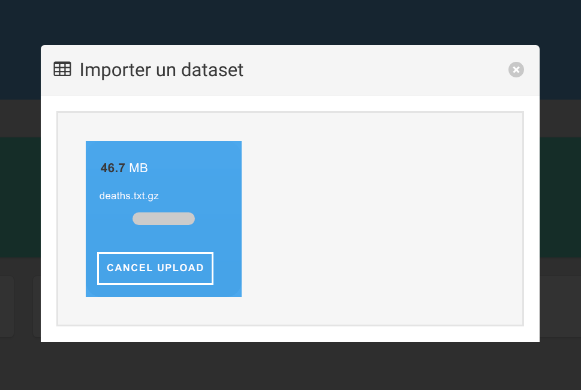
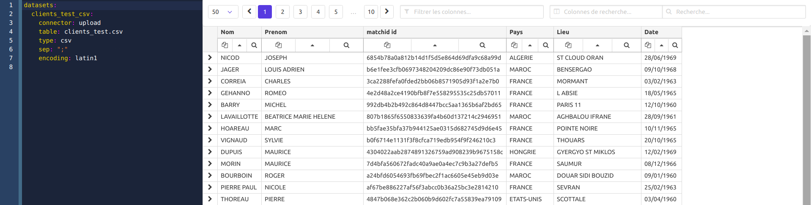
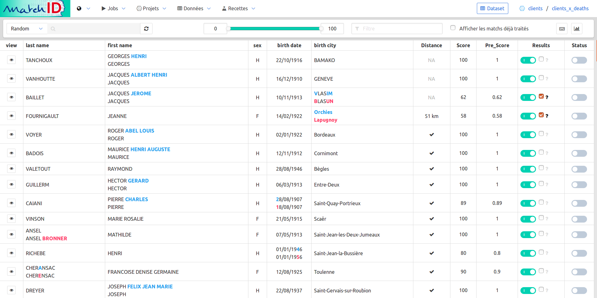
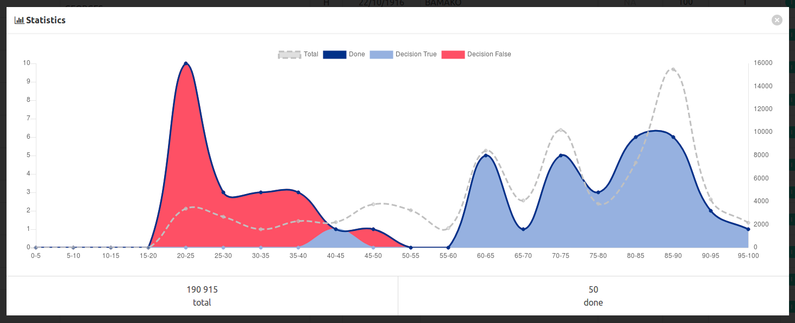
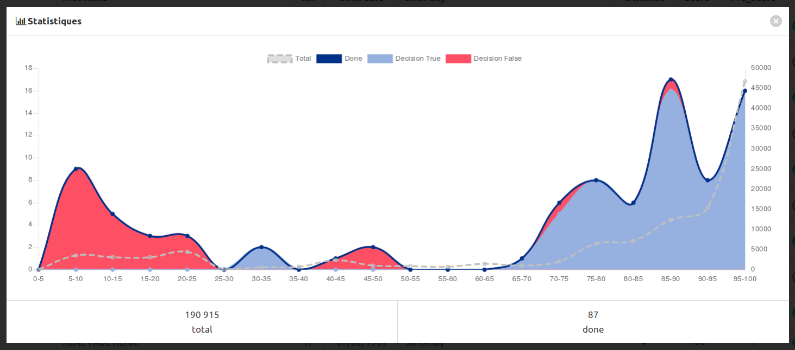

# **Quick tutorial** : finding common identities between two big datasets (easy case)

This first tutorial deals with a easy use case of matching identities of two datasets. 
An [advanced tutorial](/advanced_tutorial) is available for dealing with a more complexe case (over 1 million records), 
needing more accurate matching and using *maching learning*.

## **Cooking recipes with matchID** 

### Global method used for matching
This is our first use case : we have to remove dead people, as registered in dataset `deaths`, from a client file `clients`.
We'll follow four steps for use case 1.

- [Step 1: index deaths dataset](#step-1-index-deaths-dataset)
- [Step 2: match clients againts deaths](#step-2-match-clients)

### the philosophy of iterative cooking

So, the final goal is the match but we have first to deal with the way, which mainly is data preparation. So we'll learn here how to cook your data with recipes.

We propose a 4 or 5-step iteration method :

1. upload raw data and configuration files
2. edit yaml configuration files
3. test recipes
4. run recipes
5. (upload & apply recipe on the fly, if the goal is to develop a search api)

Iterating through these steps will allow you to create recipes and datasets for two purposes:

- prepare your datasets (upload, map names/dates/locations)
- search matches and score them 

Three further steps will enable machine learning capabilities in the [advanced tutorial](/advanced_tutorial) :

- validate the matches (through the [matchID-validation]() UI, see below)
- train machine learning models (using yaml edition and recipe testing again)
- apply for rescoring (idem)
- presenting an API for searching and rescoring new clients

The advanced use case relies on more than 50 treatments or steps. To be able to use it, you'll have to adapt it to your own use case.
But first, we'll deal with a simple use case

## start your matchID server

We suppose your matchID server is already started, as explained in [starting matchID](/starting).

Now, you can go to your `matchID` server : 

- [http://localhost/matchID/](http://localhost/matchID/)


## first project, first dataset, first recipe

### project

We'll first have to create a project. This will basically be a folder, containing datasets and recipes (data transformation). 
Here we'll simply name it `deaths`.


Which leads to:


*Note :
- The segmentation of the projects are very easy to do server-side, as it only contains two sub-folders, datasets and recipes. We didn't implement methods for splitting or reorganising project at this step of the development, as the ratio of benefit/cost of folder management is very low.
- There is no project versioning : you have to do your own versioning - at this step we do it by gitting them server side, so be careful in any change you make - git may be supported in a theorical future*.

### dataset

Click again on `import dataset` and just drag-n-drop (thx to [Dropzone](http://www.dropzonejs.com/)) the [`death_test.csv`](https://github.com/matchID-project/examples/raw/master/data/deaths_test.csv) downloaded from the [examples matchID repo](https://github.com/matchID-project/examples).



Now you have your first dataset:


Please care about the screen composition :
	- on the left pane: yaml coding part (thx to [codemirror](https://codemirror.net/)) with the dataset declaration.
	- on the right pane: the dataset view, as declared in the yaml on the left.
  
About the data: it is a clean synthetic data of French civil statuses. This file is a simple csv with no formatting or encoding problem. In the [advanced tutorial](/advanced_tutorial) you'll learn to deal with fixed with formats and encoding problems.

### first recipe

Create a new recipe :


A default recipe is created with no valid dataset, just replace it with the uploaded dataset, `deaths_test_csv` - as this can be done now, we already figure out we have a `deaths` dataset we'll configure after finishing the recipe.

```
recipes:
  dataprep_deaths_test:
    input: deaths_test_csv    # <==== necessary to change to continue
                              # there are advanced usage of dataset, such as filtered dataset, cf advanced docs
    output: deaths            # to be configured after the recipe
    steps:                    # this is the beginning of the recipe
      - eval:
          - matchid_id: sha1(row)  # just change the default 'new_col' to matchid_id which will be used further
```
Save it (`Save` button or `Ctrl+S`), it should display the first imported dataset, but with an additionnal column, `new_col` which is basically a hash of the row:


So now you have an interactive way to deal with your data. 
Every new step of the recipe will add a new transformation on your data. 
You can have the exhaustive list of [recipes here](recipes.md), and see advanced recipes in [advanced tutorial](/advanced_tutorial).

## **Step 1** - index deaths dataset

### configure the output dataset on elasticsearch

We have to create the `deaths` dataset as formerly pointed as the output dataset of the recipe. 
Just create it from the menu and paste this content :

```
datasets:
  deaths:
    connector: elasticsearch # this is the predeclared connector to the dockerized elasticsearch
    table: deaths            # name of the index
```
And don't forget to save it (`Save` button or `Ctrl+S`).
Note that you can configure many options for an elasticsearch dataset, still illustrated in the [advanced tutorial](/advanced_tutorial).

### run the recipe !
So once everything is configured, you can go to the recipe `dataprep_death_test` and run it with the green button : 


This run is needed to index the deaths with elasticearch, which will enable a match of up to 98% (recall) in real usecases.

You can follow the job either directly in the bottom in the "Real logs":


This should take about 30 seconds on your laptop to index the 35327 rows. 

The job log last line should summarize the time and bugs for the recipe :
```
2018-04-02 19:01:21.113551 - 0:00:34.571975 - end : run - Recipe dataprep_deaths_test successfully fininshed with no error, 35327 lines processed, 35327 lines written
```

## **Step 2** - match clients against deaths

### upload dataset
You should be able to follow the former steps on the new file, `clients`.

Then import the dataset [`clients_test.csv`](https://github.com/matchID-project/examples/raw/master/data/clients_test.csv).



This data is quite easy and doesn't need dataprep for quick-n-dirty results.

### matching !
Here comes the first important part : the fuzzy match with elasticsearch. 
We choose here to use elasticsearch as is it quite versatile (can perform ngram, phonetic and string-distance tolerant) for fuzzy matching.
 
So, now you have to match every client against the already-indexed-in-step-1 deaths. 

First create a recipe named `clients_deaths_matching_test`:

******************

This recipe essentially contains a complex elasticsearch query, translated from json to yaml and templated. Here's the explanation of the query.

- the client name must match fuzzily (levenshtein max 2) on of the names (first and last) of the dead person, and stricly on the birth date
- or the client name must match strictly on of the names and fuzilly (levenshtein max 1) on the birth date
- more over, if possible :
  - the last name should be the last name
  - the first name should be in the deaths names
  - the city should match
  - the country should match

Many specificities of your dataset would lead you to customize the search query : should you have poor data with no birth date, or would you have wife names, the query has to match your custom need.

All those conditions make a large recall without bringing too much candidates.

Now we create a combo recipe, `clients_deaths_matching` in the `clients` project, calling the last two ones, plus a special one, `diff` :
```
recipes:
  clients_deaths_matching:
    apply: true
    threads: 1
    test_chunk_size: 50
    input: clients_csv_gz
    output: clients_x_deaths
    steps:
      - dataprep_clients:
      - deaths_matching:
      - diff:
```      

then you should have your first sampling results (screenshot obtain using a regex filter: `diff(?!_id)|confiance|number`):


Before running these recipes, don't forger to create the `client_x_deaths` dataset in elasticsearch :

```
datasets:
  clients_x_deaths:
    connector: elasticsearch
    table: clients_x_deaths
    validation: true        # <=== this is mandatory to go to step 3
```

Run the recipe. It should take about 2 hours to run it for 1M x 1M with a 16vCPUx32Go and 3 elasticsearch nodes.


## **Step 3**: **validate** matches and train rescoring with machine learning

You don't have to wait the full run to examinate your matching results : go to the `client_x_deaths` dataset.

The `validation: true` option activates this button : 


Click on it to access to the validation mode, which enables the possibility to annotate your results :



The cheat codes page (keyboard icon) will help you understand how to annotate :


You now have two new goals

- evaluate the precision of your matches
- build a knowledge database to teach the machine

### evaluation and performance mesurement

If you're a *data scientist* you will skip this section, as of course a scientific method is your job.

If have no idea about evaluation : **evaluation is a very important thing**. 

We had a huge *chance* while building the first algorithms of `matchID` : we had a target dataset of about 27k people which were already annotated as dead in the file we had to clean. This target had no major statistical bias and we could mesure a maximum recall of 97.5% with the elasticsearch levenshtein 2 method, whereas a pure SQL method lead as to a *not so bad* 92%. But a maximum 97.5% of recall only means a point of equality to 95% (recall = precision) and to a 90% recall = 99,8% precision. All those mesures were taken on the use case of matching dead people as declared by INSEE in the French driving licence file. As we apply matchID, with various adaptations, on many use cases, we can say that performance is not an absolute thing, widely depends on the quality of your files and on your business case. So : an evaluation has to be driven on a reasonable (huge enough) amount of data to be serious. 

Performance of a matching should not be measured in a mono-dimensional score. Two factors have to be considered : precision and recall - or false alarm rate / true positive rate - which lead to [ROC curves](https://en.wikipedia.org/wiki/Receiver_operating_characteristic). Only this second method can be evaluated when you have no idea where your missed targets are (which is often the case if you have to use matchID). 

Another method for evaluation is the [cost-loss method](https://en.wikipedia.org/wiki/Cost-loss_model), which helps you choose the right threshold for your *business*.

Those methods are not helped for now in `matchID` and has to be planned in a further evolution of the frontend.

For now, you will have to take care about the amount of data you annotate (don't talk about a 99.99 precision if you didn't annotate at least 20.000 data without an error). You will have to take care about the representativity of your annotations too. `matchID` helps you in that way as the validation selects random data to annotate when you click on the reload button.

You have to follow this representativity a graph button to display some statistics : 



In this example, we annotated a bit too much easy messy data with low scores, and too few middle range scores, which are often the hardest to annotate.

With the data published in the `matchID` project, which are basically anonymized crossable dataset, we miss some representativity on the middle range scores, revealing the artificiality of our sampling. You'll see too many cases of undecidable things.

### tips for annotation
Evaluation is one goal: having better scores is another one.

So this is now we imply **machine learning**. One thing to remember : if you're a bad teacher, your machine will be a *dunce* !
And: **you first have to be a great teacher and annotate much data to be rewarded by machine learning**.

Identity matching annotation is not an easy thing and depends on your context and aims. Your decision will be influenced by your goal, but to be a good teacher you should focus on what kind of influence each one of your annotation will lead as a generalization. For example : taking a decision without all the context (e.g. with missing data) will be better if you practice *backoff*, i.e. your rely on the most probable decision given the data you see. If you think your annotation could bring a bias, it is better not to take a decision.

In the first times you'll have many situation which will seem you undecidable. For this reason we added a additive annotation (possible indecision), which may help you to come back to decide later. The more you annotate data the more you'll have your own modelisation of the data. The more you have people to annotate the smoother will be the annotation dataset. But everyone is not designed to be a teacher: every annotator has to be stable and patient, and should want to learn by himself what the data is for real (and should be greedy of annotating !).

### machine learning : the training recipe
In this case, the machine will be trained to recognize a false hit against a true hit with your annotated data. The only thing the machine will be able to learn are numerical data which are a bit more than 20 features :

- for the names :
  - levenshtein distances btw first names, last names, and cross over (last x first)
  - raw token distance
  - for now, there is no phonetic distance, which could bring some
  - frequencies of names
- for the locations :
  - distance between locations when geolocalized
  - lat/lon when geolocalized
  - booleans : same country, same department code, same history city code, same citycode
  - levenshtein distance of locations
  - population and surface of the city
- date levenshtein distance
- score boolean distance
- aggregated scores
- for the context : 
  - number of elasticsearch hits (bucket)
  - rank in within the bucket
  - max elasticsearch score of the bucket
  
So here is the recipe, `train_rescoring_model`:

```
recipes:
  train_rescoring_model:
    test_chunk_size: 10000      # <==== should not be necessary (warning: use to workaround a bug while writing the doc)
    input:
      dataset: clients_x_deaths
      chunked: False            # <==== this is for telling to get the whole data (warning: bug while writing the doc)
      select:                   # <==== this is a filtering query to load only annotated data from the dataset
        query:
          constant_score: 
            filter:
              exists:
                field:
                  validation_done

    steps:
      - build_model:
          model:
            name: clients_deaths_ml        # <==== model name
            method: RandomForestRegressor  # <==== we tested all algorithms with our R&D lab with Dataiku/DSS
            parameters:                    #       and didn't test other scikit learn model, as RandomForest
              n_estimators: 20             #       performed always well in this kind of use case
              max_depth: 4                 #       you can play with some parameters, but keep in mind that
              min_samples_leaf: 5          #       the better optimization will be to provide more data, so
            tries: 3                       #       annotate !
            test_size: 0.33                #       2/3 for training, 1/3 for testing, then we choose the best
                                           #       regressor
          numerical: .*(hit_score_(?!ml).*|population|surface|matchid_hit_distance)$
                                           #       numerical factors as described above in the text 
          #categorical: .*(matchid_location_countrycode)$
                                           #       categories have not been tested yet
          target: validation_decision      #       the target is your annotation
                                           #       the indecision is not taken into account there
```

When you save the recipe, you can see the performance of your machine learning model in the log :


In this *not serious* annotation of only 92 matches, the second model does have a perfect score. Every time you save, the algorithm trains again, and you can see how stable it is. If you have no stability at all, you should annotate more data.

If stable enough, then run the recipe, this will save the model which will be reusable.

## **Step 4**: rescore with the **machine learning** model
We can now apply the previously built model to apply a better scoring on the matches :

```
recipes:
  rescoring:
    input: clients_x_deaths
    output: 
      dataset: clients_x_deaths
      mode: update              # <=== don't forget this field, otherwise your matching data and annotations could be lost !
    steps:
      - apply_model:
          name: clients_deaths_ml
          numerical: .*(hit_score_(?!ml).*|population|surface|matchid_hit_distance)$
                                # the numerical factor must be exactly the same as in the training, otherwise the model
                                # won't apply
          target: matchid_hit_score_ml
      - eval:
          - confiance: >
              try:
                cell = round(0.7*float(matchid_hit_score_ml)+30*float(matchid_hit_score))
              except:
                try:
                  cell = matchid_hit_score_ml
                except:
                  cell = matchid_hit_score
          - scoring_version: str("{}-randomforest-{}").format(re.sub("-.*","",scoring_version),str(datetime.datetime.now()))
```

As machine learning can drift, we keep in the recipe 30% of the initial scoring to avoid complete change on full positive or full negative matches. 

You can immediately run this recipe which will just update the `confiance` column and versioning. This is a quick step, and should be over in about 15 minutes.

Then you can go check again the validation of `clients_x_deaths` to check the impact on the discrimation :



You can annotate again concentrating on new middle range scores, training again, and so on... 

To have an overview on the global process you can click on <i class="fab fa-connectdevelop"></i> to open the graph project:


