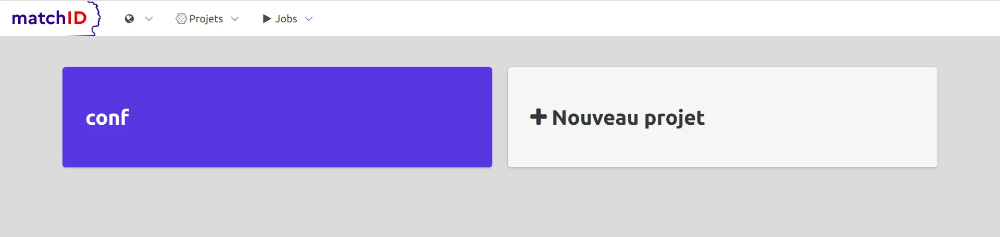

<div class="fr-col-xl-6 fr-col-lg-6 fr-col-md-6 fr-col-sm-12 fr-col-12">
    <h3>Prérequis</h3>
    <p>
        matchID nécessite de disposer <code>make</code> au préalable. Sur Ubuntu et Centos, <code>docker</code> et les autres prérequis sont automatiquement installés, dès lors que vous disposez d'un accès direct internet.
    </p>
    <p>
        Si vous êtes derrières un proxy, renseignez les variables <code>http_proxy</code> et <code>https_proxy</code>.
    </p>
</div>

<div class="fr-col-lg-6 fr-col-md-12" style="z-index:-100;">
    <table class="fr-table fr-vcenter">
        <thead>
            <tr>
                <td>Usage</td>
                <td>Configuration</td>
                <td>Capacité</td>
            </tr>
        </thead>
        <tbody>
            <tr>
                <td>Simple</td>
                <td>2vCPU, 2Go, SSD 10Go</td>
                <td>10k x 1M identés</td>
            </tr>
            <tr>
                <td>Nominal</td>
                <td>8vCPU 16Go, SSD 50Go</td>
                <td>500k x 30M identés</td>
            </tr>
            <tr>
                <td>Complexe</td>
                <td>32 à 128vCPU, 256Go à 1To, SSD 50Go</td>
                <td>100M x 100M identés</td>
            </tr>
        </tbody>
    </table>
</div>

<div class="fr-col-lg-12 fr-col-md-12">
<div class="fr-container-fluid">
<div class="fr-grid-row fr-grid-row--gutters" style="flex-direction: row-reverse;">

<div class="fr-col-lg-6 fr-col-md-6">
    <h3>Démarrer en une minute</h3>
    <p>
        Clônez le code source et rentrez dans le répertoire
        <p class="fr-highlight">
            <code>
            git clone https://github.com/matchID-project/backend<br>
            cd backend
            </code>
        </p>
    </p>
    <p>
        Lancez matchID:
       <p class="fr-highlight">
            <code>
            make up
            </code>
        </p>
    </p>
    <p class="fr-text--xs">
        En cas de problème ou de configuration avancée, reportez vous à la section
        <a title="dépannage" href="/automation#troubleshooting">section dépannage</a>.
    </p>
</div>

<div class="fr-col-xl-6 fr-col-lg-6 fr-col-md-6 fr-col-sm-12 fr-col-12">
    
</div>

</div>
</div>
</div>

<div class="fr-col-lg-12 fr-col-md-12">
    <p>
        Rendez-vous sur votre navigateur sur:
        <code>
        <a href="http://localhost:8081/matchID/" title="serveur local matchID">http://localhost:8081/matchID/</a>
        </code>
    </p>
    
</div>

<div class="fr-col-lg-6 fr-col-md-6">
    <h3>Ça n'a pas marché</h3>
    <p>
        Si l'installation n'a pas fonctionné, votre environnement est peut-être plus cloisonné, ou sur une distribution alternative (Darwin, Alpine...).
    </p>
    <p>
        Le cas échéant, installez préalablement <code>make, git, jq</code> (inclus dans les distributions), et <code><a href="https://docs.docker.com/engine/install/" title="installation docker" target="_blank">docker-ce</a></code>.
    </p>
    <p>
        Si vous n'êtes pas dans un environnement cloisonné, vous pouvez réitérer avec la commande:
    </p>
    <p class="fr-highlight">
    <code>make up</code>
    </p>
</div>

<div class="fr-col-lg-6 fr-col-md-6">
    <h3>Installation hors ligne</h3>
    <p>
        Après avoir installé <code>make, git, jq, docker-ce</code>, vous pouvez copier dans votre environnement
        le <a href="https://matchid-dist.s3.fr-par.scw.cloud/matchID-latest.tar.gz" title="télécharger le package matchID (~800Mo)">package matchID (~800Mo)</a>. Ce package comporte notamment les images docker des composants de matchID.
    </p>
    <p>
        Décompactez l'archive, lancez le script d'installation, puis démarrez matchID :
    </p>
<div class="fr-highlight" markdown="1">
```
tar xvzf matchid-latest.tar.gz
cd backend
make depackage
make up
```
</div>
</div>
<div class="fr-col-lg-12 fr-col-md-12">
    <p>
        Vous devriez retrouver matchID sur :
    </p>
    <p class="fr-text--center">
        <code>
        <a href="http://localhost:8081/matchID/" title="serveur local matchID">http://localhost:8081/matchID/</a>
        </code>
    </p>
</div>

<div class="fr-col-lg-12 fr-col-md-12">
    <h3 class="fr-text--center"> Pour continuer </h3>
</div>
<div class="fr-col-md-6 fr-col-12 fr-text--center">
    <a href="/quick_tutorial" class="fr-link fr-link--icon-right" target="_self" title="tutoriel simple">Tutoriel simple</a>
</div>
<div class="fr-col-md-6 fr-col-12 fr-text--center">
    <a href="/advanced_tutorial" class="fr-link fr-link--icon-right" target="_self" title="tutoriel avancé">Tutoriel avancé</a>
</div>

