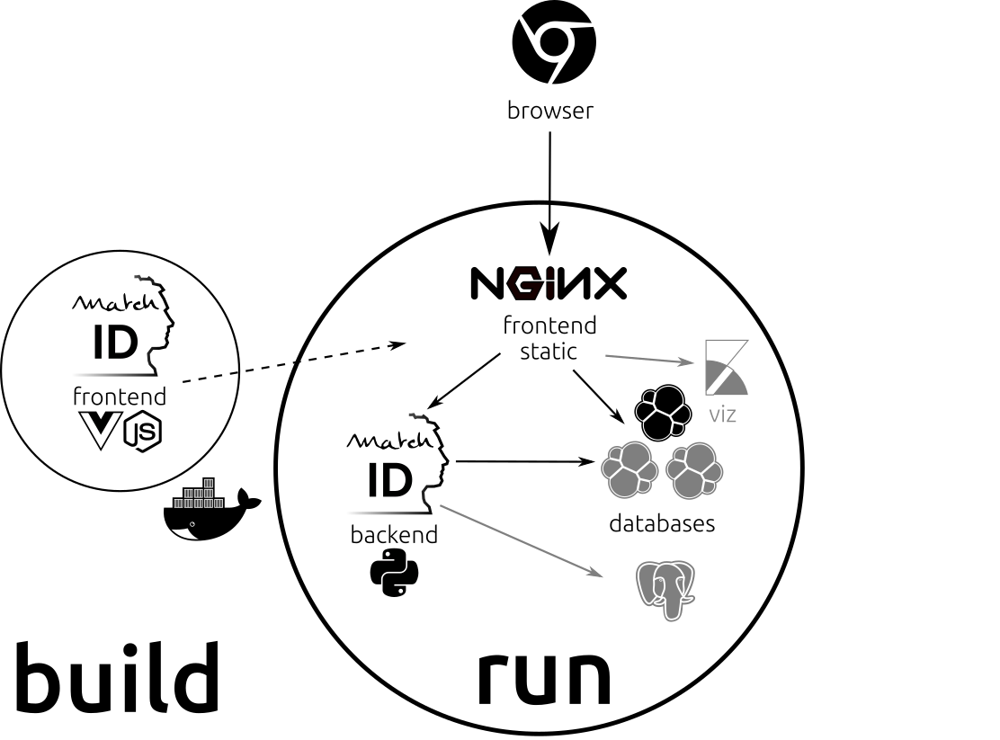

# architecture
The `make start` may take some time, as this handles many actions : 

- installing a 3-node elasticsearch cluster (if you need less, just edit `Makefile` and set `ES_NODE` to 1)
- installing `kibana` (optional, but can be useful)
- building the `python` backend, with all `pandas` and `scikit-learn` dependencies
- compiling the `Vue.js` frontend with `node` into static `html/css/js` files
- presenting all the stuff with `nginx`

Here is the architecture overview :

