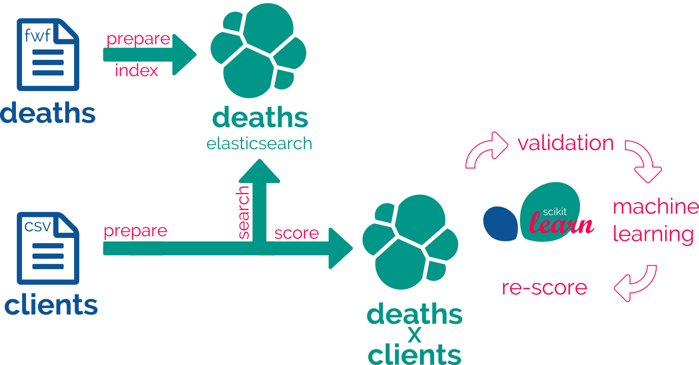
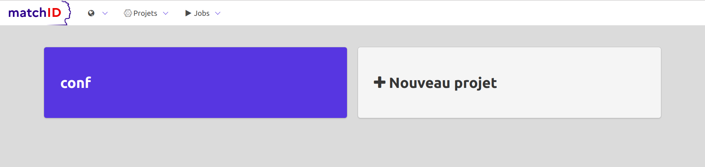
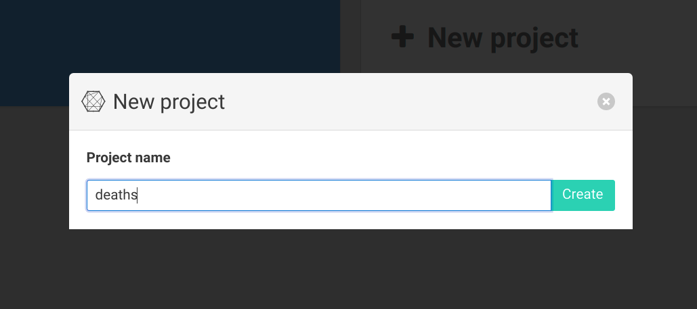
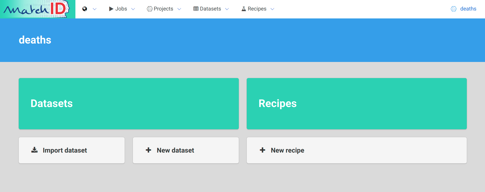
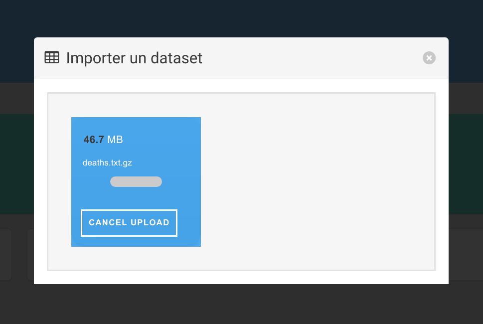
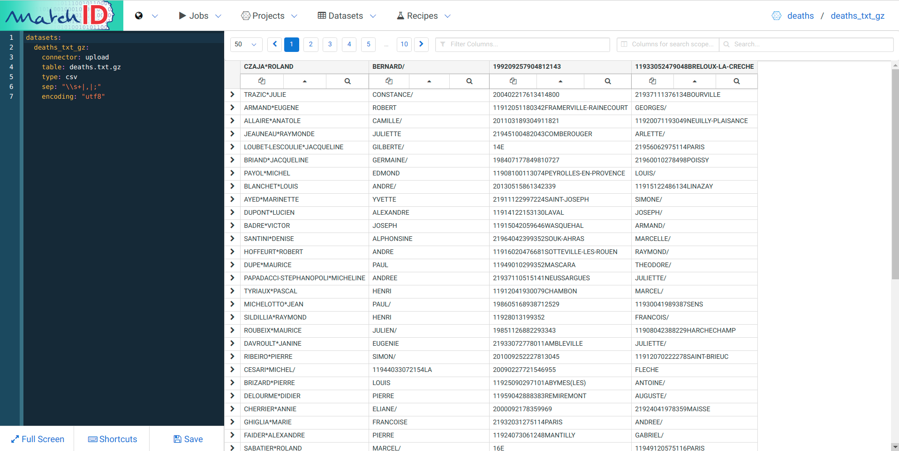
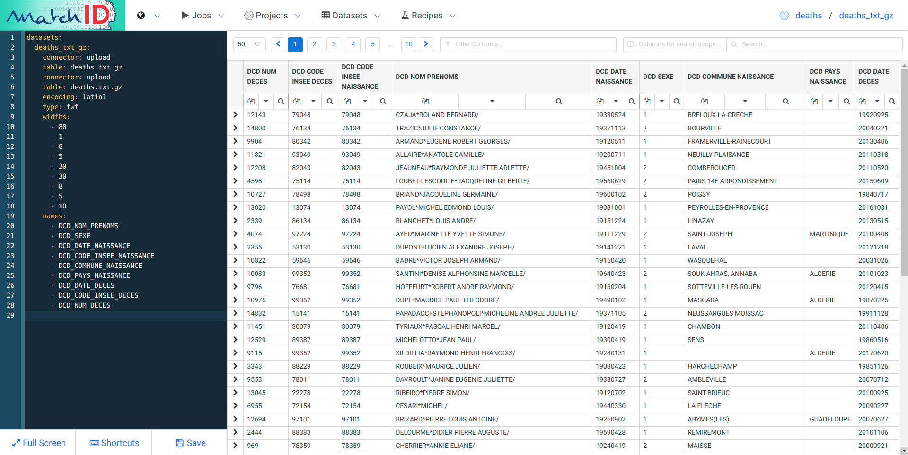

# Tutorial
This tutorial will deal with tree use-cases :
- find common identities between two big datasets
- find doubles within a dataset
- build a search api against a dataset ("top of elasticsearch" API)


## Cooking recipes with matchID 

### Global method used for matching
This is our usecase : we have to remove dead people, as registered in dataset "deaths", from a client file, "clients".
We'll follow four steps :

- 1: prepare deaths dataset
- 2: prepare clients dataset, match it against dataset 1 & score the matches
- 3: validate matches and train rescoring with machine learning
- 4: rescore with the machine learning kernel




### the philosophy of iterative cooking

So, the final goal is the match but we have first to deal with the way, which mainly is data preparation. So we'll learn here how to cook your data with recipes.

We propose a 4-step iterated method :
- upload raw data and configuration files
- edit yaml configuration files
- test recipes
- run recipes

Depending on your usecsae, if the goal is to develop a search api, you can have a fifth step:
- upload & apply recipe live

Iterating through theses steps will allow you to create recipes and datasets for two purposes:
- prepare your datasets (upload, map names/dates/locations)
- search matches and score them 

3 further steps will enable machine learning capability:
- validate the matches (through the [matchID-validation]() UI cf below)
- train machine learning models (using yaml edition and recipe testing again)
- apply for rescoring (idem)

In the final round, matching a dataset of people, `clients`, against another already index-one, `death`  will look like this recipe :
```
recipes:
  clients_deaths_matching:
    apply: True
    input: clients_csv
    output: clients_x_deaths
    steps:
      - dataprep_clients:
      - deaths_matching:
      - diff:
      - rescoring_clients_x_deaths:
```

This lead to have a new API endpoint, http://localhost/matchID/api/v0/recipes/clients_deaths_matching/apply where you'll just have to post every new month of your csv raw data, to get the json of ml-rescored potential candidates to remove.

This quite simple overview, relies in fact relying on more than 50 steps of treatments, so you'll have to work a bit more to adapt it to your case.
This recipes, against a some-millions `death` reference dataset, should gives about 10 matches/seconds on a up-to-date laptop, and around, 150 matches/second on a good 1U server.


## starting a developpement matchID server

A laptop with >8Go configuration is recommended to have a first look on matchID. Good performance with need higher computation resources (the higher the better : 16-cores + 128Go will be 15x faster than a laptop, we tested up-scaling to 40-cores for 40x faster).

matchID uses make and Docker to accelerate installation of dependencies. You'll first have to install Docker and docker-compose.

Then clone the project : 
```
git clone https://github.com/matchID-project/backend
```

and start the tutorial mode, which download, compiles necessary stuff, and launch the backend, frontend and elasticsearch :
```
make tuto
```
Any problems ? See the [troubleshooting](https://github.com/matchID-project/backend#frequent-running-problems) section.

Note that machine learning is not mandatory (you can have a real serious matching only based on rules) but recommended for reducting development time.

So you can go to your matchID server : [http://localhost](http://localhost)



## first project, first dataset, first recipe

### project
We'll first have to create a project. This will basically be a folder, containing datasets and recipes (data transformation). A good segmentation is to build a project for each goal : our use case is to match deaths within a client file, so we basically chose to have two projects: deaths, and clients. Just clic on `new project` and name the first one `deaths`:



Which leads to:


*Note :
- The segmentation of the projects are very easy to do server-side, as it only conains two sub-folders, datasets and recipes. We didn't implement method for splitting or reorganising project at this step of the dev, as the ratio of benefit/cost of folder management is very low.
- There is not versionning of the projects : you have to do your own version - at this step we do it by gitting them server side, so be careful in any change you make - git may be supported in a potential theorical future*

### dataset
Repeat clicking on `import dataset`, and just drag-n-drop (thx to [Dropzone](http://www.dropzonejs.com/)) the [`death.txt.gz`](https://github.com/matchID-project/examples/raw/master/data/deaths.txt.gz) you just downloaded from the [examples matchID repo](https://github.com/matchID-project/examples).



Now you have your first dataset:


We have many observation.
First the screen composition :
- left: yaml coding part (thx to [codemirror](https://codemirror.net/)) which is the declaration of the dataset
- right: the view of the dataset, as declared in the yaml

Secondly the data:
- the data seem real : well no, this data is quite realistic but synthetic data of french civil states. The statistics of the columns of the first, last names, and birth places are realistic, but not the association of the three.
- the columns doesn't seem ok, names and columns are not correct : that file is a realistic example of a fixed width file format, and matches the INSEE Rnipp official format

Take a look in a terminal of your gzipped fwf data :
```
$ zcat death.txt.gz | head -5
CZAJA*ROLAND BERNARD/                                                           11933052479048BRELOUX-LA-CRECHE                                           199209257904812143     
TRAZIC*JULIE CONSTANCE/                                                         21937111376134BOURVILLE                                                   200402217613414800     
ARMAND*EUGENE ROBERT GEORGES/                                                   11912051180342FRAMERVILLE-RAINECOURT                                      20130406803429904      
ALLAIRE*ANATOLE CAMILLE/                                                        11920071193049NEUILLY-PLAISANCE                                           201103189304911821     
JEAUNEAU*RAYMONDE JULIETTE ARLETTE/                                             21945100482043COMBEROUGER                                                 201105208204312208   
```

Well, it's quite boring do decrypt it so here is the solution, just copy-paste it on the dataset yaml code (each important line is commented) :
```
datasets:
  deaths_txt_gz:
    connector: upload             # the filesystem connector name, where drag'n dropped files are put
    table: deaths.txt.gz          # filename - could be a regex if multiple files
    encoding: latin1              # the encoding of the file, often utf8 for recent files
    type: fwf                     # type of the file : could be csv (tabular text), fwf (fixed with) or hdf5 (binary format)
    widths:                       # widths of the successive columns, as it is a fwf 
      - 80
      - 1
      - 8
      - 5
      - 30
      - 30
      - 8
      - 5
      - 10
    names:                       # names of the successive columns, that you can customize
      - DCD_NOM_PRENOMS
      - DCD_SEXE
      - DCD_DATE_NAISSANCE
      - DCD_CODE_INSEE_NAISSANCE
      - DCD_COMMUNE_NAISSANCE
      - DCD_PAYS_NAISSANCE
      - DCD_DATE_DECES
      - DCD_CODE_INSEE_DECES
      - DCD_NUM_DECES
```


Now you save that with `Ctrl+S` or the `Save` button.

**Warning : mind any change you make to your code. Any change is definitive, and you may loose your code if you change the two first lines of the yaml code.**

 *if you're lost you can go to the `tutorial` folder to `rm -f tutorial/projects/deaths/datasets/deaths_txt_gz.yml` and try it again. You can even `rm -rf tutorial/projects/deaths` and give a new birth to your project*

Here you are:


 
 


